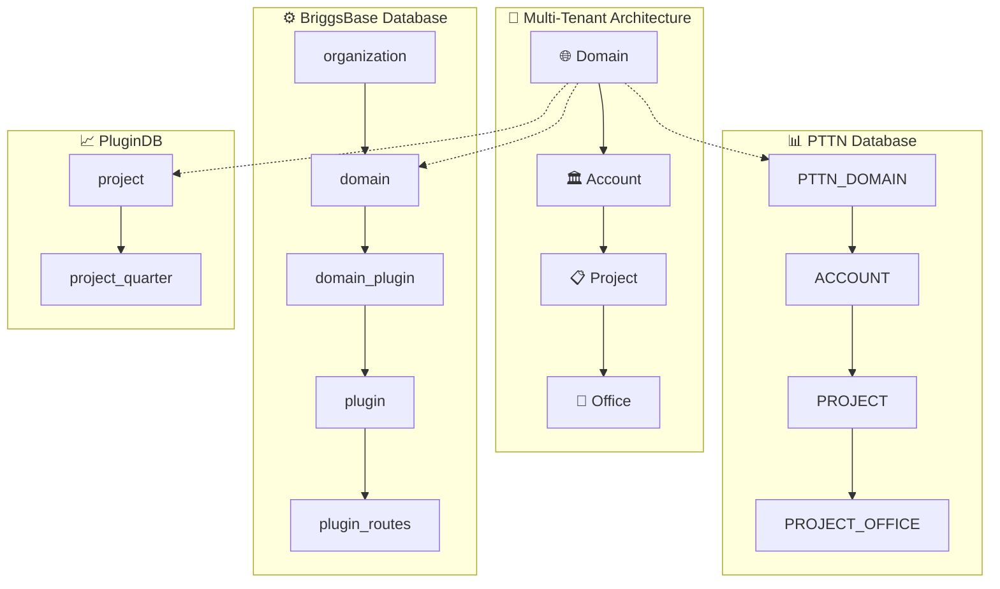

# Database Documentation Index

## 🤖 AI-Optimized Database Documentation

This directory contains comprehensive, AI-optimized documentation for all databases in the BriggsSystem multi-tenant ERP architecture. Each document follows consistent patterns to enable efficient AI code generation.

## 📚 Documentation Files

### 🎯 Primary Documents

| Database | Purpose | AI Focus | File |
|----------|---------|----------|------|
| **📊 PTTN** | Core business data with 4-level authorization | Domain → Account → Project → Office security model | [`pttn-database-schema.md`](./pttn-database-schema.md) |
| **⚙️ BriggsBase** | Gateway configuration and plugin management | Domain-aware routing and plugin activation | [`briggsbase-database-schema.md`](./briggsbase-database-schema.md) |
| **📈 PluginDB** | Plugin-specific data storage | Domain-isolated plugin data patterns | [`plugindb-database-schema.md`](./plugindb-database-schema.md) |
| **📦 DWH MySQL** | Operational warehouse (`dwh8` and client DWH databases) owned by `Briggs-Walker/DWH` | Poll from PTTN SQL views; not a fourth canonical schema in this folder | [`pttn-database-schema.md`](./pttn-database-schema.md) (PTTN source tables) + catalog `DWH` |
| **🔄 Access Patterns** | Cross-database access patterns and security | Multi-database authorization and performance | [`database-access-patterns.md`](./database-access-patterns.md) |

## 🚀 Quick Start for AI Agents

### 🎯 Use Case → Documentation Mapping

| AI Task | Primary Document | Supporting Documents |
|---------|------------------|---------------------|
| **🔐 User Authorization** | PTTN Schema | Access Patterns |
| **🛣️ Gateway Configuration** | BriggsBase Schema | Access Patterns |
| **📊 Plugin Data Storage** | PluginDB Schema | Access Patterns |
| **🔄 Multi-Database Operations** | Access Patterns | All schema documents |
| **🏢 Domain Management** | PTTN + BriggsBase | Access Patterns |

### 🚨 Critical AI Guidelines

1. **🔐 Domain Isolation**: Every query must include domain filtering
2. **🏗️ 4-Level Authorization**: Domain → Account → Project → Office validation required
3. **✍️ Write Operations**: Use Rulesengine API for PTTN writes, direct access for others
4. **⚡ Performance**: Always use provided index recommendations and caching patterns

## 📋 Consistency Features

All documentation files include:

- ✅ **🤖 AI Guidelines** section with critical rules and use cases
- ✅ **🔥 Quick Start** code examples with copy-paste ready snippets  
- ✅ **🛡️ Business Rules** validation with comprehensive examples
- ✅ **⚡ Performance Guidelines** with ✅/❌ patterns and index recommendations
- ✅ **🤖 Code Generation Templates** for common operations
- ✅ **🎯 AI Use Case** annotations throughout
- ✅ **🚨 Critical warnings** for security and performance

## 🔗 Related Documentation

- **Application Architecture**: [`../application-architecture.md`](../application-architecture.md) - System design principles
- **Domain Architecture**: [`../domain-architecture.md`](../domain-architecture.md) - Multi-tenant security model
- **Stack Documentation**: [`../stack/`](../stack/) - Technology-specific implementation guides

## 📊 Database Schema Overview



## 🎯 Code Generation Quick Reference

### Essential Patterns for AI

```csharp
// 🔐 4-Level Authorization Check
WHERE d.DOMAIN_CODE = @domainCode 
AND (uda.ACCOUNT_ID IS NULL OR uda.ACCOUNT_ID = a.ACCOUNT_ID)
AND (uda.PROJECT_ID IS NULL OR uda.PROJECT_ID = p.PROJECT_ID)
AND (uda.OFFICE_ID IS NULL OR uda.OFFICE_ID = po.OFFICE_ID)

// 🛣️ Gateway Route Discovery
var routes = await context.PluginRoutes
    .Include(pr => pr.Plugin.DomainPlugins)
    .Where(pr => pr.Plugin.DomainPlugins
        .Any(dp => dp.Domain.Code == domainCode && dp.IsActive))

// 📊 Plugin Data with Domain Isolation
var data = await context.PluginEntities
    .Where(e => e.DomainCode == domainCode && e.Active)
```

## 📈 Last Updated

**Last Comprehensive Update**: June 15, 2025  
**AI Optimization Level**: Full ✅  
**Cross-Reference Validation**: Complete ✅  
**Performance Guidelines**: Current ✅
