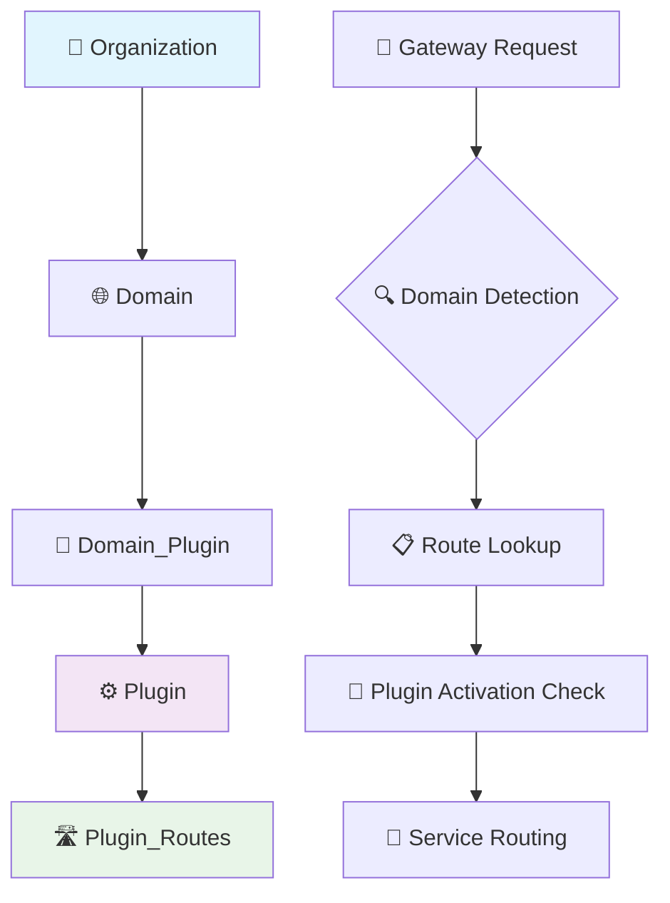

# BriggsBase Database Schema

## 🤖 AI GUIDELINES FOR BRIGGSBASE DATABASE

**🎯 Primary Use**: Generate gateway configuration, plugin management, and domain organization code  
**🔐 Critical Rule**: Plugin activation must respect domain boundaries  
**⚡ Quick Start**: Use Entity Framework patterns with domain-aware filtering  

### 🚨 CRITICAL FOR AI: Configuration Management
```csharp
// ✅ ALWAYS validate domain-plugin relationships
WHERE dp.Domain.Code = @domainCode AND dp.IsActive = true
// ❌ NEVER activate plugins without domain validation
```

**🎯 AI Use Cases**:
- 🛣️ **Gateway Config**: Generate KrakenD route discovery code
- 🔌 **Plugin Management**: Create domain-aware plugin activation
- 🏢 **Organization Setup**: Build multi-tenant organization management
- 🌐 **Domain Routing**: Implement domain-based service routing

## 🗄️ Database Overview

**Database**: BriggsBase (SQL Server)  
**Purpose**: 🔌 Plugin registry, 🛣️ routing configuration, 🏢 domain/organization management  
**Access Pattern**: 📖 Read-heavy for gateway config, ✍️ write for plugin registration  
**Total Tables**: 6 (all in dbo schema)  
**Schema Type**: 🏗️ Modern Entity Framework Core with migrations  

### 🎯 AI Focus Areas
- **Gateway Integration**: Route discovery and plugin activation for KrakenD
- **Multi-Tenant Management**: Domain-based organization and user access
- **Plugin Lifecycle**: Registration, activation, and configuration management
- **Service Discovery**: Dynamic service routing and load balancing  

## 🤖 AI Code Generation Quick Start

> 🔧 **Gateway Integration**: For technical implementation of gateway patterns, see:
> - [`stack/krakend/krakend-patterns.md`](../stack/krakend/krakend-patterns.md) - Gateway configuration implementation
> - [`stack/dotnet/dotnet-patterns.md`](../stack/dotnet/dotnet-patterns.md) - Service registration and HTTP client patterns

### 🔥 Most Common Operations
```csharp
// 🛣️ Gateway route discovery for KrakenD
var activeRoutes = await context.PluginRoutes
    .Include(pr => pr.Plugin)
    .ThenInclude(p => p.DomainPlugins)
    .Where(pr => pr.Plugin.DomainPlugins
        .Any(dp => dp.Domain.Code == domainCode && dp.IsActive))
    .Select(pr => new RouteConfig
    {
        Path = pr.Path,
        Method = pr.Method,
        UpstreamUrl = $"{pr.Plugin.ServiceUrl}{pr.UpstreamPath}",
        PluginId = pr.PluginId
    })
    .ToListAsync();

// 🔌 Domain-aware plugin activation
var domainPlugins = await context.DomainPlugins
    .Include(dp => dp.Plugin)
    .Include(dp => dp.Domain)
    .Where(dp => dp.Domain.Code == domainCode && dp.IsActive)
    .Select(dp => new ActivePlugin
    {
        PluginId = dp.PluginId,
        Name = dp.Plugin.Name,
        Version = dp.Plugin.Version,
        ServiceUrl = dp.Plugin.ServiceUrl,
        ActivatedAt = dp.ActivatedAt
    })
    .ToListAsync();

// 🏢 Organization domain management
var orgDomains = await context.Organizations
    .Where(o => o.Id == organizationId)
    .SelectMany(o => context.Domains.Where(d => 
        d.Code == o.PrimaryGlobalDomain || 
        d.Code == o.PrimaryAgencyDomain))
    .ToListAsync();

// 🔧 Plugin registration with domain activation
var plugin = new Plugin 
{ 
    Id = pluginDto.Id, 
    Name = pluginDto.Name,
    Version = pluginDto.Version,
    ServiceUrl = pluginDto.ServiceUrl,
    CreatedAt = DateTime.UtcNow
};

context.Plugins.Add(plugin);

// Auto-activate for specified domains
foreach (var domainCode in pluginDto.ActivateDomains)
{
    var domain = await context.Domains.FirstAsync(d => d.Code == domainCode);
    context.DomainPlugins.Add(new DomainPlugin
    {
        PluginId = plugin.Id,
        DomainId = domain.Id,
        IsActive = true,
        ActivatedAt = DateTime.UtcNow
    });
}

await context.SaveChangesAsync();
```

## Table Schema Reference

### 1. dbo.organization
```csharp
public class Organization
{
    public long Id { get; set; }                      // PK, Identity
    public string Name { get; set; }                  // NVARCHAR(450), Unique, Required
    public string? PrimaryGlobalDomain { get; set; }  // NVARCHAR(MAX)
    public string? PrimaryGlobalOffice { get; set; }  // NVARCHAR(MAX)
    public string? PrimaryAgencyDomain { get; set; }  // NVARCHAR(MAX)
    public string? PrimaryAgencyOffice { get; set; }  // NVARCHAR(MAX)
    public DateTime CreatedAt { get; set; }           // DATETIME2, Default: getutcdate()
    public string? CCN { get; set; }                  // NVARCHAR(MAX)
    public string? CompanyAddress { get; set; }       // NVARCHAR(MAX)
    public string? CompanyCountry { get; set; }       // VARCHAR(60)
    public string? CompanyWebsite { get; set; }       // NVARCHAR(MAX)
    public string? Industry { get; set; }             // VARCHAR(60)
    public string? LegalEntityName { get; set; }      // NVARCHAR(MAX)
    public string? NoOfFundraisers { get; set; }      // VARCHAR(60)
    
    // Navigation Properties
    public ICollection<Domain> Domains { get; set; }
}
```

### 2. dbo.domain
```csharp
public class Domain
{
    public long Id { get; set; }                      // PK, Identity
    public string Code { get; set; }                  // NVARCHAR(450), Unique, Required
    public long? OrganizationId { get; set; }         // FK to organization.Id
    
    // Navigation Properties
    public Organization? Organization { get; set; }
    public ICollection<DomainPlugin> DomainPlugins { get; set; }
}
```

### 3. dbo.plugin
```csharp
public class Plugin
{
    public string Id { get; set; }                    // PK, NVARCHAR(450)
    public string DeploymentMode { get; set; }        // NVARCHAR(MAX), Required
    public string Name { get; set; }                  // NVARCHAR(MAX), Required
    public string? BackendURL { get; set; }           // NVARCHAR(MAX)
    public string? FrontendURL { get; set; }          // NVARCHAR(MAX)
    public string BackendPort { get; set; }           // NVARCHAR(MAX), Default: ''
    public string FrontendPort { get; set; }          // NVARCHAR(MAX), Default: ''
    public string? GatewayPath { get; set; }          // NVARCHAR(MAX)
    public int? PluginIndex { get; set; }             // INT
    
    // Navigation Properties
    public ICollection<PluginRoute> PluginRoutes { get; set; }
    public ICollection<DomainPlugin> DomainPlugins { get; set; }
}
```

### 4. dbo.plugin_routes
```csharp
public class PluginRoute
{
    public long Id { get; set; }                      // PK, Identity
    public string Path { get; set; }                  // NVARCHAR(450), Required
    public string? Backend { get; set; }              // NVARCHAR(MAX)
    public string Method { get; set; }                // NVARCHAR(450), Required
    public string? AuthRole { get; set; }             // NVARCHAR(MAX)
    public string PluginId { get; set; }              // FK to plugin.Id, Required
    public string? RouteGatewayAuthorization { get; set; } // NVARCHAR(MAX)
    public string? RouteType { get; set; }            // VARCHAR(60)
    
    // Navigation Properties
    public Plugin Plugin { get; set; }
}
```

### 5. dbo.domain_plugin
```csharp
public class DomainPlugin
{
    // Note: Exact schema available in /dbdump/briggsbase/tableschemas/dbo.domain_plugin.md
    // This is the many-to-many relationship table between domains and plugins
    public long DomainId { get; set; }               // FK to domain.Id
    public string PluginId { get; set; }             // FK to plugin.Id
    
    // Navigation Properties
    public Domain Domain { get; set; }
    public Plugin Plugin { get; set; }
}
```

### 6. dbo.__EFMigrationsHistory
Standard Entity Framework Core migrations table - no custom code needed.

## Entity Framework DbContext

```csharp
public class BriggsBaseContext : DbContext
{
    public DbSet<Organization> Organizations { get; set; }
    public DbSet<Domain> Domains { get; set; }
    public DbSet<Plugin> Plugins { get; set; }
    public DbSet<PluginRoute> PluginRoutes { get; set; }
    public DbSet<DomainPlugin> DomainPlugins { get; set; }
    
    protected override void OnModelCreating(ModelBuilder modelBuilder)
    {
        // Organization
        modelBuilder.Entity<Organization>(entity =>
        {
            entity.HasKey(e => e.Id);
            entity.HasIndex(e => e.Name).IsUnique();
            entity.Property(e => e.CreatedAt).HasDefaultValueSql("(getutcdate())");
            entity.Property(e => e.BackendPort).HasDefaultValue("");
            entity.Property(e => e.FrontendPort).HasDefaultValue("");
        });
        
        // Domain
        modelBuilder.Entity<Domain>(entity =>
        {
            entity.HasKey(e => e.Id);
            entity.HasIndex(e => e.Code).IsUnique();
            entity.HasOne(e => e.Organization)
                  .WithMany(o => o.Domains)
                  .HasForeignKey(e => e.OrganizationId)
                  .OnDelete(DeleteBehavior.NoAction);
        });
        
        // Plugin
        modelBuilder.Entity<Plugin>(entity =>
        {
            entity.HasKey(e => e.Id);
        });
        
        // PluginRoute
        modelBuilder.Entity<PluginRoute>(entity =>
        {
            entity.HasKey(e => e.Id);
            entity.HasIndex(e => new { e.Path, e.Method, e.PluginId }).IsUnique();
            entity.HasOne(e => e.Plugin)
                  .WithMany(p => p.PluginRoutes)
                  .HasForeignKey(e => e.PluginId)
                  .OnDelete(DeleteBehavior.Cascade);
        });
        
        // DomainPlugin (Many-to-Many)
        modelBuilder.Entity<DomainPlugin>(entity =>
        {
            entity.HasKey(e => new { e.DomainId, e.PluginId }); // Composite key
            entity.HasOne(e => e.Domain)
                  .WithMany(d => d.DomainPlugins)
                  .HasForeignKey(e => e.DomainId);
            entity.HasOne(e => e.Plugin)
                  .WithMany(p => p.DomainPlugins)
                  .HasForeignKey(e => e.PluginId);
        });
    }
}
```

## Common Queries for AI Generation

### Gateway Configuration Queries
```csharp
// Get all plugins with their routes for KrakenD configuration
var gatewayConfig = await context.Plugins
    .Include(p => p.PluginRoutes)
    .Select(p => new
    {
        PluginId = p.Id,
        PluginName = p.Name,
        GatewayPath = p.GatewayPath,
        BackendURL = p.BackendURL,
        Routes = p.PluginRoutes.Select(r => new
        {
            Path = r.Path,
            Method = r.Method,
            Backend = r.Backend,
            AuthRole = r.AuthRole
        })
    })
    .ToListAsync();
```

### Domain Management Queries
```csharp
// Get organization with all domains and their activated plugins
var orgWithDomains = await context.Organizations
    .Include(o => o.Domains)
    .ThenInclude(d => d.DomainPlugins)
    .ThenInclude(dp => dp.Plugin)
    .FirstOrDefaultAsync(o => o.Id == organizationId);

// Get plugins activated for a specific domain
var domainPlugins = await context.Domains
    .Where(d => d.Code == domainCode)
    .SelectMany(d => d.DomainPlugins)
    .Include(dp => dp.Plugin)
    .ThenInclude(p => p.PluginRoutes)
    .Select(dp => dp.Plugin)
    .ToListAsync();

// Check if plugin is activated for domain
var isActivated = await context.DomainPlugins
    .AnyAsync(dp => dp.DomainId == domainId && dp.PluginId == pluginId);
```

### Plugin Management Queries
```csharp
// Register new plugin with routes
var plugin = new Plugin
{
    Id = "new-plugin-id",
    Name = "New Plugin",
    DeploymentMode = "container",
    BackendURL = "http://new-plugin:8080",
    GatewayPath = "/api/new-plugin"
};

var routes = new List<PluginRoute>
{
    new PluginRoute
    {
        PluginId = plugin.Id,
        Path = "/api/new-plugin/data",
        Method = "GET",
        Backend = "http://new-plugin:8080/data",
        AuthRole = "user"
    }
};

context.Plugins.Add(plugin);
context.PluginRoutes.AddRange(routes);
await context.SaveChangesAsync();

// Activate plugin for domain
var domainPlugin = new DomainPlugin
{
    DomainId = domainId,
    PluginId = pluginId
};
context.DomainPlugins.Add(domainPlugin);
await context.SaveChangesAsync();
```

## Repository Pattern Examples

### IOrganizationRepository
```csharp
public interface IOrganizationRepository
{
    Task<Organization?> GetByIdAsync(long id);
    Task<Organization?> GetByNameAsync(string name);
    Task<IEnumerable<Organization>> GetAllAsync();
    Task<Organization> CreateAsync(Organization organization);
    Task UpdateAsync(Organization organization);
    Task DeleteAsync(long id);
}

public class OrganizationRepository : IOrganizationRepository
{
    private readonly BriggsBaseContext _context;
    
    public OrganizationRepository(BriggsBaseContext context)
    {
        _context = context;
    }
    
    public async Task<Organization?> GetByIdAsync(long id)
    {
        return await _context.Organizations
            .Include(o => o.Domains)
            .FirstOrDefaultAsync(o => o.Id == id);
    }
    
    public async Task<Organization> CreateAsync(Organization organization)
    {
        _context.Organizations.Add(organization);
        await _context.SaveChangesAsync();
        return organization;
    }
}
```

### IPluginRepository
```csharp
public interface IPluginRepository
{
    Task<Plugin?> GetByIdAsync(string id);
    Task<IEnumerable<Plugin>> GetAllAsync();
    Task<IEnumerable<Plugin>> GetByDomainAsync(string domainCode);
    Task<Plugin> RegisterAsync(Plugin plugin, IEnumerable<PluginRoute> routes);
    Task ActivateForDomainAsync(string pluginId, long domainId);
    Task DeactivateForDomainAsync(string pluginId, long domainId);
}

public class PluginRepository : IPluginRepository
{
    private readonly BriggsBaseContext _context;
    
    public PluginRepository(BriggsBaseContext context)
    {
        _context = context;
    }
    
    public async Task<IEnumerable<Plugin>> GetByDomainAsync(string domainCode)
    {
        return await _context.Domains
            .Where(d => d.Code == domainCode)
            .SelectMany(d => d.DomainPlugins.Select(dp => dp.Plugin))
            .Include(p => p.PluginRoutes)
            .ToListAsync();
    }
    
    public async Task<Plugin> RegisterAsync(Plugin plugin, IEnumerable<PluginRoute> routes)
    {
        using var transaction = await _context.Database.BeginTransactionAsync();
        try
        {
            _context.Plugins.Add(plugin);
            await _context.SaveChangesAsync();
            
            foreach (var route in routes)
            {
                route.PluginId = plugin.Id;
                _context.PluginRoutes.Add(route);
            }
            await _context.SaveChangesAsync();
            
            await transaction.CommitAsync();
            return plugin;
        }
        catch
        {
            await transaction.RollbackAsync();
            throw;
        }
    }
}
```

## Service Layer Examples

### PluginConfigurationService
```csharp
public class PluginConfigurationService
{
    private readonly IPluginRepository _pluginRepository;
    private readonly IDomainRepository _domainRepository;
    
    public PluginConfigurationService(
        IPluginRepository pluginRepository,
        IDomainRepository domainRepository)
    {
        _pluginRepository = pluginRepository;
        _domainRepository = domainRepository;
    }
    
    public async Task<GatewayConfiguration> GenerateGatewayConfigAsync()
    {
        var plugins = await _pluginRepository.GetAllAsync();
        
        return new GatewayConfiguration
        {
            Endpoints = plugins
                .SelectMany(p => p.PluginRoutes.Select(r => new GatewayEndpoint
                {
                    Endpoint = $"{p.GatewayPath}{r.Path}",
                    Method = r.Method,
                    Backend = r.Backend ?? $"{p.BackendURL}{r.Path}",
                    AuthRole = r.AuthRole
                }))
                .ToList()
        };
    }
    
    public async Task<bool> ActivatePluginForDomainAsync(string pluginId, string domainCode)
    {
        var domain = await _domainRepository.GetByCodeAsync(domainCode);
        if (domain == null) return false;
        
        await _pluginRepository.ActivateForDomainAsync(pluginId, domain.Id);
        return true;
    }
}
```

## AI Development Guidelines

### When to Use This Database
- **Plugin registration** during deployment
- **Gateway route configuration** for KrakenD
- **Domain/organization management** for multi-tenancy
- **Plugin activation/deactivation** per domain

### Code Generation Best Practices
1. **Always include navigation properties** in Entity Framework models
2. **Use transactions** for multi-table operations (plugin + routes)
3. **Implement repository pattern** for testability
4. **Add proper indexes** on foreign keys and query columns
5. **Use async/await** for all database operations
6. **Handle cascading deletes** carefully (especially plugin routes)

### Common Patterns
- **Plugin registration**: Plugin + Routes as atomic operation
- **Domain queries**: Always filter by domain code for multi-tenancy
- **Gateway config**: Join plugins with routes for complete routing table
- **Organization hierarchy**: Organization → Domains → Plugins

## Connection String Configuration

```json
{
  "ConnectionStrings": {
    "BriggsBase": "Server=sqlserver;Database=briggsbase-dev;uid=briggsbase;Password=***;MultipleActiveResultSets=True"
  }
}
```

## 🔗 Entity Relationships & Gateway Integration

### 🛣️ KrakenD Gateway Configuration Flow


### 🎯 AI Use Case: Gateway Route Discovery
```csharp
// Generate complete gateway configuration
public async Task<GatewayConfig> BuildGatewayConfigAsync(string domainCode)
{
    var domain = await context.Domains
        .Include(d => d.DomainPlugins)
        .ThenInclude(dp => dp.Plugin)
        .ThenInclude(p => p.PluginRoutes)
        .FirstOrDefaultAsync(d => d.Code == domainCode);
    
    if (domain == null) 
        throw new DomainNotFoundException($"Domain {domainCode} not found");
    
    return new GatewayConfig
    {
        DomainCode = domainCode,
        Endpoints = domain.DomainPlugins
            .Where(dp => dp.IsActive)
            .SelectMany(dp => dp.Plugin.PluginRoutes)
            .Select(pr => new EndpointConfig
            {
                Method = pr.Method,
                Pattern = pr.Path,
                Backend = new[]
                {
                    new BackendConfig
                    {
                        Host = ExtractHost(pr.Plugin.ServiceUrl),
                        UrlPattern = pr.UpstreamPath,
                        Method = pr.Method
                    }
                }
            })
            .ToList()
    };
}
```

## 🛡️ Business Rules & Validation

### 🚨 CRITICAL BUSINESS RULES FOR AI

#### 🔐 Domain-Plugin Activation Rules
```csharp
// ✅ Plugin can only be activated for domains within same organization
public async Task<ValidationResult> ValidatePluginActivationAsync(
    string pluginId, string domainCode, string userEmail)
{
    var plugin = await context.Plugins.FindAsync(pluginId);
    var domain = await context.Domains
        .Include(d => d.Organization)
        .FirstOrDefaultAsync(d => d.Code == domainCode);
    
    if (plugin == null)
        return ValidationResult.Error($"Plugin {pluginId} not found");
    
    if (domain == null)
        return ValidationResult.Error($"Domain {domainCode} not found");
    
    // 🚨 CRITICAL: Check organization boundaries
    if (!await IsUserAuthorizedForOrganizationAsync(userEmail, domain.Organization.Id))
        return ValidationResult.Error($"User {userEmail} not authorized for organization");
    
    // 🚨 CRITICAL: Check plugin compatibility
    if (!await IsPluginCompatibleWithDomainAsync(pluginId, domainCode))
        return ValidationResult.Error($"Plugin {pluginId} not compatible with domain {domainCode}");
    
    return ValidationResult.Success();
}
```

#### 🏢 Organization Domain Management
```csharp
// ✅ Organization can have multiple domains but must have primary domains
public class OrganizationValidator
{
    public async Task<ValidationResult> ValidateOrganizationDomainsAsync(Organization org)
    {
        var errors = new List<string>();
        
        // Must have at least one primary domain
        if (string.IsNullOrEmpty(org.PrimaryGlobalDomain) && 
            string.IsNullOrEmpty(org.PrimaryAgencyDomain))
        {
            errors.Add("Organization must have at least one primary domain");
        }
        
        // Validate domain existence and accessibility
        if (!string.IsNullOrEmpty(org.PrimaryGlobalDomain))
        {
            var globalDomain = await context.Domains
                .FirstOrDefaultAsync(d => d.Code == org.PrimaryGlobalDomain);
            if (globalDomain == null)
                errors.Add($"Primary global domain {org.PrimaryGlobalDomain} does not exist");
        }
        
        return errors.Any() 
            ? ValidationResult.Error(string.Join("; ", errors))
            : ValidationResult.Success();
    }
}
```

## ⚡ Performance Guidelines

### ✅ Recommended Patterns
- **Route Caching**: Cache gateway routes for 10 minutes
- **Plugin Status**: Cache active plugins per domain for 5 minutes  
- **Organization Data**: Cache organization-domain mappings for 30 minutes
- **Bulk Operations**: Use batch processing for plugin registrations

### ❌ Performance Anti-Patterns
- **Per-request route lookup**: Always cache route configurations
- **Cross-organization queries**: Never query multiple organizations
- **Missing indexes**: Ensure proper indexing on domain and plugin relationships
- **Large result sets**: Always paginate plugin and route listings

### 🔍 Critical Indexes for AI Code Generation
```sql
-- Gateway route discovery optimization
CREATE INDEX IX_DomainPlugin_Domain_Active 
ON dbo.domain_plugin (domain_id, is_active)
INCLUDE (plugin_id, activated_at);

-- Plugin route lookup optimization  
CREATE INDEX IX_PluginRoutes_Plugin_Method_Path
ON dbo.plugin_routes (plugin_id, method, path)
INCLUDE (upstream_path);

-- Organization domain lookup
CREATE INDEX IX_Domain_Organization_Code
ON dbo.domain (organization_id, code)
INCLUDE (name, created_at);
```

## 🤖 AI Code Generation Templates

### 🔧 Service Registration Template
```csharp
// Generate service registration for new microservices
public class ServiceRegistrationTemplate
{
    public async Task<string> GenerateServiceRegistrationAsync(ServiceDefinition definition)
    {
        return $@"
// Auto-generated service registration for {definition.ServiceName}
public class {definition.ServiceName}Registration : IServiceRegistration
{{
    public async Task RegisterAsync(IServiceCollection services, IConfiguration config)
    {{
        // Register plugin
        var plugin = new Plugin
        {{
            Id = ""{definition.ServiceId}"",
            Name = ""{definition.ServiceName}"",
            Version = ""{definition.Version}"",
            ServiceUrl = config.GetValue<string>(""Services:{definition.ServiceName}:BaseUrl""),
            CreatedAt = DateTime.UtcNow
        }};
        
        // Register routes
        var routes = new[]
        {{
{string.Join(",\n            ", definition.Routes.Select(r => 
    $@"new PluginRoute {{ Method = ""{r.Method}"", Path = ""{r.Path}"", UpstreamPath = ""{r.UpstreamPath}"" }}"))}
        }};
        
        await context.RegisterPluginWithRoutesAsync(plugin, routes);
    }}
}}";
    }
}
```

