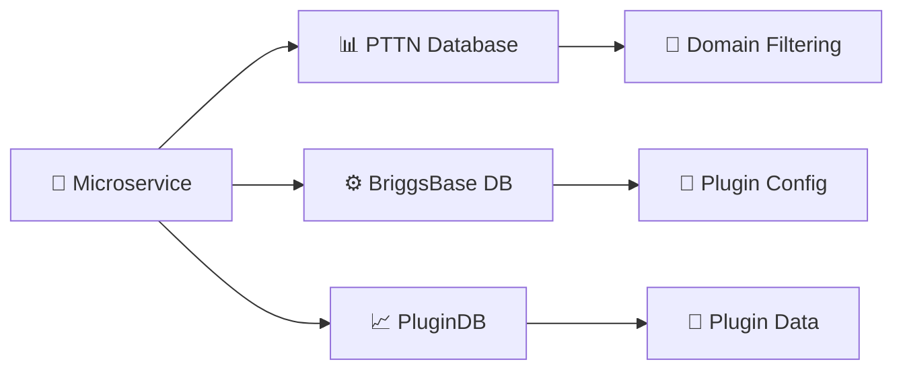
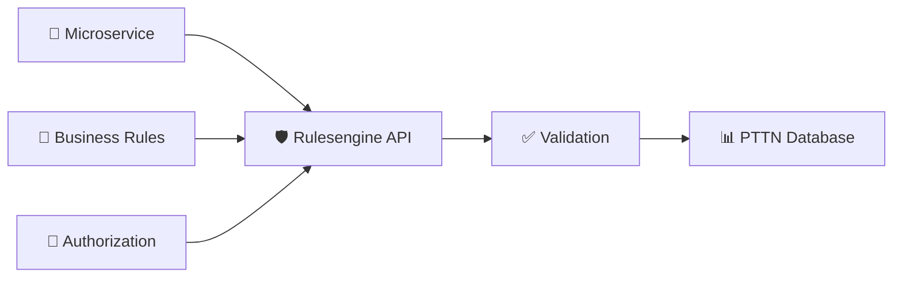
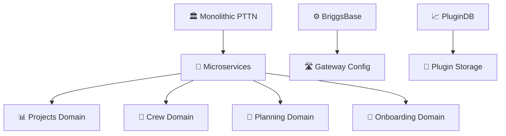

# Database Access Patterns

## 🤖 AI GUIDELINES FOR DATABASE ACCESS

**🎯 Primary Use**: Generate secure, domain-aware database access code  
**🔐 Critical Rule**: ALL queries must respect 4-level authorization hierarchy  
**⚡ Quick Start**: Use ready-to-copy code examples below  

### 🚨 CRITICAL FOR AI: Multi-Tenant Security
```csharp
// ✅ ALWAYS include domain filtering
WHERE d.DomainCode = @domainCode 
// ❌ NEVER query without domain context
```

**🎯 AI Use Cases**:
- 🔍 **Data Access**: Generate repositories with domain isolation
- 🛡️ **Authorization**: Implement 4-level security model
- 🚀 **Performance**: Optimize queries with proper filtering
- 🔄 **Patterns**: Apply consistent access patterns

## 🗄️ Database Schema Overview

### 📊 PTTN Database (Core Business Data)
**Purpose**: Multi-tenant ERP with 4-level authorization hierarchy  
**Schema**: 584+ tables across pttn, dbo, and cdc schemas  
**🎯 AI Focus**: Domain → Account → Project → Office authorization model

**🔑 Key Authorization Tables**:
- `pttn.PTTN_DOMAIN` (45+ columns) - 🏢 **Global vs Agency domains**
- `pttn.ACCOUNT` (42 columns) - 🏛️ **Account/organization management**  
- `pttn.PROJECT` (43+ columns) - 📋 **Project definitions with domain inheritance**
- `pttn.PROJECT_OFFICE` (20+ columns) - 🏢 **Office-level access control**

**🎯 AI Use Case**: Generate domain-scoped queries for any business entity

### ⚙️ BriggsBase Database (System Configuration)
**Purpose**: Plugin registry, routing configuration, domain management  
**Schema**: 6 tables in dbo schema (Entity Framework Core)  
**🎯 AI Focus**: Gateway routing and plugin activation

**🔑 Key Configuration Tables**:
- `dbo.organization` - 🏢 Organization/company management
- `dbo.domain` - 🌐 Multi-tenant domain definitions  
- `dbo.plugin` - 🔌 Plugin/microservice registration
- `dbo.plugin_routes` - 🛣️ API route definitions

**🎯 AI Use Case**: Generate gateway configuration and plugin management code

### 📈 PluginDB Database (Plugin Data Storage)
**Purpose**: Plugin-specific data storage and processing  
**Schema**: 3 tables (quarter_completion + dbo schemas)  
**🎯 AI Focus**: Isolated plugin data with domain awareness

**🔑 Key Plugin Tables**:
- `quarter_completion.project` (14 columns) - Project tracking
- `quarter_completion.project_quarter` (12 columns) - Geographic data

**🎯 AI Use Case**: Generate plugin-specific CRUD operations

## 🔄 Access Pattern Overview

### 📖 Read Patterns (Direct Database Access)


### ✍️ Write Patterns (Controlled via API)


**🚨 CRITICAL**: All writes to PTTN must go through Rulesengine API for validation

## Database-Specific Access Patterns

## 🏗️ Database-Specific Access Patterns

### 📊 PTTN Database Access
**🎯 Primary Use**: Multi-tenant business data with 4-level authorization  
**🔐 Access Pattern**: Domain-scoped reads with API-controlled writes

#### 📖 Read Access Pattern
```csharp
// 🚨 CRITICAL: Always include 4-level authorization check
public async Task<IEnumerable<Project>> GetUserProjectsAsync(string userEmail, string domainCode)
{
    var sql = @"
        SELECT p.*, pd.DOMAIN_CODE, a.ACCOUNT_NAME, po.OFFICE_NAME
        FROM pttn.PROJECT p
        INNER JOIN pttn.PROJECT_PTTN_DOMAIN pd ON p.PROJECT_ID = pd.PROJECT_ID
        INNER JOIN pttn.PTTN_DOMAIN d ON pd.DOMAIN_CODE = d.DOMAIN_CODE
        INNER JOIN pttn.ACCOUNT a ON p.ACCOUNT_ID = a.ACCOUNT_ID
        INNER JOIN pttn.PROJECT_OFFICE po ON p.PROJECT_ID = po.PROJECT_ID
        WHERE d.DOMAIN_CODE = @domainCode 
        AND EXISTS (
            SELECT 1 FROM pttn.USER_DOMAIN_ACCESS uda 
            WHERE uda.USER_EMAIL = @userEmail 
            AND uda.DOMAIN_CODE = @domainCode
            AND (uda.ACCOUNT_ID IS NULL OR uda.ACCOUNT_ID = a.ACCOUNT_ID)
            AND (uda.PROJECT_ID IS NULL OR uda.PROJECT_ID = p.PROJECT_ID)
            AND (uda.OFFICE_ID IS NULL OR uda.OFFICE_ID = po.OFFICE_ID)
        )";
    
    return await connection.QueryAsync<Project>(sql, new { userEmail, domainCode });
}
```

#### ✍️ Write Access Pattern
```csharp
// ✅ PREFERRED: Use Rulesengine API
public async Task<bool> UpdateProjectAsync(int projectId, ProjectUpdateDto updateDto)
{
    var client = httpClientFactory.CreateClient("RulesengineAPI");
    var response = await client.PostAsJsonAsync($"/api/projects/{projectId}", updateDto);
    return response.IsSuccessStatusCode;
}

// ⚠️ ALTERNATIVE: Stored procedures (only if API not available)
public async Task<bool> UpdateProjectDirectAsync(int projectId, ProjectUpdateDto updateDto)
{
    var parameters = new DynamicParameters();
    parameters.Add("@ProjectId", projectId);
    parameters.Add("@DomainCode", updateDto.DomainCode);
    parameters.Add("@UserEmail", updateDto.UserEmail);
    // Add other parameters...
    
    var result = await connection.QuerySingleAsync<int>(
        "pttn.sp_UpdateProjectWithValidation", 
        parameters, 
        commandType: CommandType.StoredProcedure
    );
    
    return result > 0;
}
```

**🔧 Example Services Using PTTN**:
- `pttn-projectsapi` - 📋 Project and shift data with full authorization
- `pttn-crewapi` - 👥 Crew member information with domain filtering  
- `pttn-planningapi` (alias `pttn-planning-api`) - 📅 Shift planning with office-level access
- `pttn-onboarding-api` - 🏢 Organization setup with domain inheritance

### ⚙️ BriggsBase Database Access
**🎯 Primary Use**: Gateway configuration and domain/plugin management  
**🔐 Access Pattern**: Configuration-driven with controlled plugin activation

#### 📖 Read Access Pattern
```csharp
// Gateway route discovery for KrakenD
public async Task<IEnumerable<PluginRoute>> GetActiveRoutesAsync(string domainCode)
{
    return await context.PluginRoutes
        .Include(pr => pr.Plugin)
        .Where(pr => pr.Plugin.DomainPlugins
            .Any(dp => dp.Domain.Code == domainCode && dp.IsActive))
        .ToListAsync();
}

// User domain access validation
public async Task<bool> ValidateUserDomainAccessAsync(string userEmail, string domainCode)
{
    return await context.UserDomainAccess
        .AnyAsync(uda => uda.UserEmail == userEmail 
                     && uda.Domain.Code == domainCode 
                     && uda.IsActive);
}
```

#### ✍️ Write Access Pattern
```csharp
// Plugin registration during deployment
public async Task RegisterPluginAsync(PluginRegistrationDto pluginDto)
{
    var plugin = new Plugin
    {
        Id = pluginDto.Id,
        Name = pluginDto.Name,
        Version = pluginDto.Version,
        ServiceUrl = pluginDto.ServiceUrl
    };
    
    context.Plugins.Add(plugin);
    
    foreach (var route in pluginDto.Routes)
    {
        context.PluginRoutes.Add(new PluginRoute
        {
            PluginId = plugin.Id,
            Path = route.Path,
            Method = route.Method,
            UpstreamPath = route.UpstreamPath
        });
    }
    
    await context.SaveChangesAsync();
}
```

**🔧 Example Services Using BriggsBase**:
- `briggsbase` - 🏗️ Core configuration management
- `briggs-gateway-api` - 🛣️ Route discovery for KrakenD
- `pttn-onboarding-api` - 🔌 Plugin activation during setup

### 📈 PluginDB Database Access
**🎯 Primary Use**: Domain-isolated plugin data storage and processing  
**🔐 Access Pattern**: Full CRUD with domain awareness per plugin

#### 📖 Read/Write Access Pattern
```csharp
// Domain-scoped plugin data access
public async Task<IEnumerable<Project>> GetDomainProjectsAsync(string domainCode)
{
    return await context.Projects
        .Include(p => p.ProjectQuarters)
        .Where(p => p.DomainCode == domainCode && p.Active)
        .ToListAsync();
}

// Plugin-specific calculations with domain isolation
public async Task<QuarterCompletionStats> CalculateCompletionAsync(string domainCode, int projectId)
{
    var stats = await context.ProjectQuarters
        .Where(pq => pq.Project.DomainCode == domainCode 
                  && pq.Project.Id == projectId)
        .Select(pq => new QuarterCompletionStats
        {
            LocationName = pq.LocationName,
            CompletionPercentage = (pq.Score / pq.Threshold) * 100,
            IsComplete = pq.Score >= pq.Threshold,
            TargetDate = pq.TargetDate
        })
        .ToListAsync();
    
    return new QuarterCompletionStats
    {
        TotalLocations = stats.Count,
        CompletedLocations = stats.Count(s => s.IsComplete),
        OverallCompletion = stats.Average(s => s.CompletionPercentage)
    };
}

// Plugin data processing with audit trail
public async Task<bool> ProcessProjectDataAsync(int projectId, string domainCode, string userEmail)
{
    var project = await context.Projects
        .FirstOrDefaultAsync(p => p.Id == projectId && p.DomainCode == domainCode);
    
    if (project == null) return false;
    
    project.Processing = true;
    project.ProcessingStartedAt = DateTime.UtcNow;
    project.ProcessingStartedBy = userEmail;
    
    await context.SaveChangesAsync();
    return true;
}
```

**🔧 Example Services Using PluginDB**:
- `briggslogging` - 📋 Centralized audit logging with domain isolation
- `quarter-completion-plugin` - 📊 Geographic quarter tracking
- Custom plugins - 🔌 Domain-aware data storage

## 🔗 Connection String Patterns

### 🌍 Environment-Based Configuration
```json
{
  "ConnectionStrings": {
    "PTTN": "Server=${DB_SERVER};Database=PTTN;Integrated Security=true;TrustServerCertificate=true;MultipleActiveResultSets=true;",
    "Briggsbase": "Server=${DB_SERVER};Database=Briggsbase;Integrated Security=true;TrustServerCertificate=true;",
    "Plugindb": "Server=${DB_SERVER};Database=Plugindb;Integrated Security=true;TrustServerCertificate=true;"
  },
  "DomainSettings": {
    "DefaultDomain": "${DEFAULT_DOMAIN_CODE}",
    "RequireDomainValidation": true
  }
}
```

### 🏗️ Development vs Production
- **Development**: Local SQL Server with connection pooling
- **Production**: Azure SQL Database with Managed Identity
- **Authentication**: 
  - 🔧 **Dev**: Integrated Security  
  - ☁️ **Prod**: Azure Managed Identity + connection pooling
  - 🧪 **Test**: Service Principal authentication

### 🚨 Critical Connection Settings
```csharp
// Required for PTTN database (handles multiple result sets)
builder.Services.AddDbContext<PttnContext>(options =>
    options.UseSqlServer(connectionString, sqlOptions =>
    {
        sqlOptions.EnableRetryOnFailure(3);
        sqlOptions.CommandTimeout(30);
    }));

// Connection pooling for high-traffic services
builder.Services.AddDbContext<BriggsbaseContext>(options =>
    options.UseSqlServer(connectionString), 
    ServiceLifetime.Scoped,
    optionsLifetime: ServiceLifetime.Singleton);
```

## 🤖 AI Code Generation Guidelines

> 🔧 **.NET Implementation Patterns**: For technical implementation of these patterns, see:
> - [`stack/dotnet/dotnet-patterns.md`](../stack/dotnet/dotnet-patterns.md) - Repository and service layer implementation
> - [`stack/dotnet/dotnet-quick-reference.md`](../stack/dotnet/dotnet-quick-reference.md) - Quick setup and configuration

### 🎯 Essential Patterns for AI Generation

#### 1. 🏗️ Repository Pattern with Domain Isolation
```csharp
// ✅ ALWAYS generate repositories with domain filtering
public interface IProjectRepository
{
    Task<IEnumerable<Project>> GetProjectsByDomainAsync(string domainCode, string userEmail);
    Task<Project> GetProjectByIdAsync(int projectId, string domainCode, string userEmail);
    Task<bool> ValidateProjectAccessAsync(int projectId, string userEmail, string domainCode);
}

public class ProjectRepository : IProjectRepository
{
    private readonly IDbConnection _connection;
    
    public ProjectRepository(IDbConnection connection)
    {
        _connection = connection;
    }
    
    public async Task<bool> ValidateProjectAccessAsync(int projectId, string userEmail, string domainCode)
    {
        var sql = @"
            SELECT COUNT(1)
            FROM pttn.PROJECT p
            INNER JOIN pttn.PROJECT_PTTN_DOMAIN pd ON p.PROJECT_ID = pd.PROJECT_ID
            WHERE p.PROJECT_ID = @projectId 
            AND pd.DOMAIN_CODE = @domainCode
            AND EXISTS (
                SELECT 1 FROM pttn.USER_DOMAIN_ACCESS uda 
                WHERE uda.USER_EMAIL = @userEmail 
                AND uda.DOMAIN_CODE = @domainCode
                AND (uda.PROJECT_ID IS NULL OR uda.PROJECT_ID = @projectId)
            )";
        
        var count = await _connection.QuerySingleAsync<int>(sql, new { projectId, userEmail, domainCode });
        return count > 0;
    }
}
```

#### 2. 🔐 Authorization Service Pattern
```csharp
// Generate authorization services for 4-level hierarchy validation
public interface IAuthorizationService
{
    Task<bool> ValidateDomainAccessAsync(string userEmail, string domainCode);
    Task<bool> ValidateAccountAccessAsync(string userEmail, string domainCode, int accountId);
    Task<bool> ValidateProjectAccessAsync(string userEmail, string domainCode, int projectId);
    Task<bool> ValidateOfficeAccessAsync(string userEmail, string domainCode, int officeId);
    Task<UserPermissions> GetUserPermissionsAsync(string userEmail, string domainCode);
}

public class UserPermissions
{
    public string DomainCode { get; set; }
    public List<int> AccessibleAccountIds { get; set; } = new();
    public List<int> AccessibleProjectIds { get; set; } = new();
    public List<int> AccessibleOfficeIds { get; set; } = new();
    public bool IsGlobalAccess { get; set; }
    public AuthorizationLevel Level { get; set; }
}

public enum AuthorizationLevel
{
    Domain = 1,    // Can access all within domain
    Account = 2,   // Limited to specific accounts
    Project = 3,   // Limited to specific projects  
    Office = 4     // Limited to specific offices
}
```

#### 3. 🔍 Query Pattern Templates
```csharp
// ✅ Standard domain-scoped query pattern
public async Task<IEnumerable<T>> GetDomainEntitiesAsync<T>(string domainCode, string userEmail)
{
    var sql = @"
        SELECT e.* 
        FROM {EntityTable} e 
        INNER JOIN pttn.PROJECT_PTTN_DOMAIN pd ON e.PROJECT_ID = pd.PROJECT_ID
        INNER JOIN pttn.PTTN_DOMAIN d ON pd.DOMAIN_CODE = d.DOMAIN_CODE
        WHERE d.DOMAIN_CODE = @domainCode 
        AND EXISTS (
            SELECT 1 FROM pttn.USER_DOMAIN_ACCESS uda 
            WHERE uda.USER_EMAIL = @userEmail 
            AND uda.DOMAIN_CODE = @domainCode
            AND (uda.PROJECT_ID IS NULL OR uda.PROJECT_ID = e.PROJECT_ID)
        )
        AND e.IS_ACTIVE = 1";
    
    return await _connection.QueryAsync<T>(sql, new { domainCode, userEmail });
}

// ✅ Performance-optimized query with proper indexing hints
public async Task<PagedResult<T>> GetPagedDomainEntitiesAsync<T>(
    string domainCode, string userEmail, int page, int pageSize)
{
    var sql = @"
        WITH DomainEntities AS (
            SELECT e.*, ROW_NUMBER() OVER (ORDER BY e.CREATED_DATE DESC) as RowNum
            FROM {EntityTable} e WITH (INDEX(IX_Entity_DomainCode_Active))
            INNER JOIN pttn.PROJECT_PTTN_DOMAIN pd ON e.PROJECT_ID = pd.PROJECT_ID
            WHERE pd.DOMAIN_CODE = @domainCode 
            AND e.IS_ACTIVE = 1
        )
        SELECT * FROM DomainEntities 
        WHERE RowNum BETWEEN @startRow AND @endRow";
    
    var startRow = (page - 1) * pageSize + 1;
    var endRow = page * pageSize;
    
    return await _connection.QueryAsync<T>(sql, new { domainCode, startRow, endRow });
}
```

#### 4. 🛡️ Secure Controller Pattern
```csharp
// Generate controllers with automatic domain validation
[ApiController]
[Route("api/[controller]")]
// Identity comes from KrakenD headers (x-sub, x-user-domain, x-auth-projects).
// Do not add [Authorize] / AddJwtBearer in the service.
public class ProjectsController : ControllerBase
{
    private readonly IProjectRepository _projectRepository;
    private readonly IAuthorizationService _authService;
    
    [HttpGet("{domainCode}")]
    public async Task<ActionResult<IEnumerable<Project>>> GetProjects(
        string domainCode, 
        [FromQuery] int page = 1, 
        [FromQuery] int pageSize = 20)
    {
        var userEmail = Request.Headers["x-email"].FirstOrDefault(); // KrakenD-propagated identity, not local JWT parse
        
        // 🚨 CRITICAL: Validate domain access first
        if (!await _authService.ValidateDomainAccessAsync(userEmail, domainCode))
        {
            return Forbid($"User {userEmail} does not have access to domain {domainCode}");
        }
        
        var projects = await _projectRepository.GetProjectsByDomainAsync(domainCode, userEmail);
        return Ok(projects);
    }
    
    [HttpPost("{domainCode}/projects")]
    public async Task<ActionResult<Project>> CreateProject(
        string domainCode, 
        [FromBody] CreateProjectRequest request)
    {
        var userEmail = User.GetEmail();
        
        // Validate both domain and account access for creation
        if (!await _authService.ValidateAccountAccessAsync(userEmail, domainCode, request.AccountId))
        {
            return Forbid($"User {userEmail} cannot create projects in account {request.AccountId}");
        }
        
        // 🚨 CRITICAL: Use Rulesengine API for writes
        var client = _httpClientFactory.CreateClient("RulesengineAPI");
        var response = await client.PostAsJsonAsync($"/api/{domainCode}/projects", request);
        
        if (response.IsSuccessStatusCode)
        {
            var project = await response.Content.ReadFromJsonAsync<Project>();
            return CreatedAtAction(nameof(GetProject), new { domainCode, id = project.Id }, project);
        }
        
        return BadRequest("Failed to create project");
    }
}
```

## ⚡ Performance Considerations

### 🎯 Query Optimization Guidelines

#### ✅ Recommended Patterns
- **Index Usage**: Always use domain-based composite indexes
- **Connection Pooling**: Configure appropriate pool sizes (min: 5, max: 100)
- **Read Replicas**: Use read replicas for reporting queries
- **Caching**: Implement Redis caching for domain configuration data

#### ❌ Performance Anti-Patterns
- **Cross-domain queries**: Never query multiple domains in single query
- **Missing domain filters**: Always include domain filtering in WHERE clause
- **N+1 queries**: Use Include() or JOIN for related data
- **Unbounded queries**: Always implement pagination

### 📊 Specific Optimization Strategies

#### 🔍 Index Recommendations
```sql
-- Critical indexes for 4-level authorization
CREATE INDEX IX_PROJECT_DOMAIN_USER_ACCESS 
ON pttn.PROJECT (PROJECT_ID) 
INCLUDE (ACCOUNT_ID, CREATED_DATE)
WHERE IS_ACTIVE = 1;

CREATE INDEX IX_USER_DOMAIN_ACCESS_LOOKUP
ON pttn.USER_DOMAIN_ACCESS (USER_EMAIL, DOMAIN_CODE, PROJECT_ID)
INCLUDE (ACCOUNT_ID, OFFICE_ID)
WHERE IS_ACTIVE = 1;

-- Domain-specific indexes for common queries
CREATE INDEX IX_PTTN_DOMAIN_CODE_ACTIVE
ON pttn.PTTN_DOMAIN (DOMAIN_CODE)
INCLUDE (DOMAIN_NAME, DOMAIN_TYPE)
WHERE IS_ACTIVE = 1;
```

#### 🚀 Connection Pooling Configuration
```csharp
// Optimized connection settings for high-traffic services
services.AddDbContextPool<PttnContext>(options =>
{
    options.UseSqlServer(connectionString, sqlOptions =>
    {
        sqlOptions.EnableRetryOnFailure(
            maxRetryCount: 3,
            maxRetryDelay: TimeSpan.FromSeconds(5),
            errorNumbersToAdd: null);
        sqlOptions.CommandTimeout(30);
    });
}, poolSize: 128); // Adjust based on concurrent users

// Redis caching for domain configuration
services.AddStackExchangeRedisCache(options =>
{
    options.Configuration = redisConnectionString;
    options.InstanceName = "BriggsSystem";
});
```

#### 📈 Monitoring and Alerting
```csharp
// Performance monitoring for database operations
public class DatabasePerformanceMiddleware
{
    public async Task InvokeAsync(HttpContext context, RequestDelegate next)
    {
        var stopwatch = Stopwatch.StartNew();
        
        await next(context);
        
        stopwatch.Stop();
        
        if (stopwatch.ElapsedMilliseconds > 1000) // Alert on slow queries
        {
            logger.LogWarning("Slow database operation detected: {ElapsedMs}ms for {Path}", 
                stopwatch.ElapsedMilliseconds, context.Request.Path);
        }
    }
}
```

### 🔐 Security Performance Balance
- **Domain Validation Caching**: Cache user domain permissions for 5 minutes
- **Authorization Queries**: Optimize permission checks with materialized views
- **Audit Logging**: Use async logging to avoid blocking operations

## 🏗️ Migration Strategy & Future Architecture

### 📋 Current State → Future State Evolution

#### Phase 1: 📖 Documentation & Current Patterns ✅
- ✅ Document existing 4-level authorization model
- ✅ Establish domain-aware access patterns  
- ✅ Create AI-optimized code generation guidelines
- ✅ Implement secure repository patterns

#### Phase 2: 🔧 Service Modernization (In Progress)


#### Phase 3: 🗂️ Database Decomposition (Future)
- **Projects Domain**: Project, Location, Quarter data with dedicated DB
- **Crew Domain**: Crew member, Performance, Marketing data isolation  
- **Planning Domain**: Shift, Assignment, Schedule data separation
- **Onboarding Domain**: Organization, User, Domain data consolidation

#### Phase 4: ☁️ Cloud-Native Architecture (Long-term)
- **Event-Driven**: Domain events for cross-service communication
- **CQRS**: Separate read/write models for performance
- **Saga Pattern**: Distributed transaction management
- **Eventual Consistency**: Domain-aware data synchronization

### 🎯 Database Decomposition Strategy

#### 🔍 Domain Boundary Analysis
```csharp
// Current: Single PTTN database with domain filtering
public class ProjectService
{
    // Multi-tenant data access in single DB
    public async Task<Project> GetProjectAsync(int projectId, string domainCode)
    {
        return await _context.Projects
            .Where(p => p.Id == projectId && p.DomainCode == domainCode)
            .FirstOrDefaultAsync();
    }
}

// Future: Domain-specific databases
public class ProjectDomainService
{
    // Dedicated project database per domain context
    public async Task<Project> GetProjectAsync(int projectId)
    {
        // No domain filtering needed - database is already domain-isolated
        return await _projectContext.Projects
            .Where(p => p.Id == projectId)
            .FirstOrDefaultAsync();
    }
}
```

#### 🛠️ Migration Guidelines for AI Code Generation

**🚨 CRITICAL**: When generating migration code, always:

1. **Preserve Domain Isolation**: Every query must validate domain access
2. **Maintain Data Integrity**: Use transactions for cross-domain updates  
3. **Enable Rollback**: Keep legacy patterns until migration is complete
4. **Monitor Performance**: Track query performance during migration

```csharp
// Migration-safe repository pattern
public interface IMigrationAwareRepository<T>
{
    Task<T> GetByIdAsync(int id, string domainCode);
    Task<T> GetByIdLegacyAsync(int id, string domainCode); // Fallback to old pattern
    Task<bool> MigrateEntityAsync(int id, string sourceDomain, string targetDomain);
}
```

### 📚 Documentation Cross-References

This access pattern documentation works with:
- **📊 PTTN Database Schema** → Detailed authorization model and business rules
- **⚙️ BriggsBase Schema** → Plugin and gateway configuration patterns  
- **📈 PluginDB Schema** → Plugin-specific data isolation patterns

**🎯 For AI Agents**: Always reference these three schema documents together when generating database access code. The patterns here provide the "how", while the schema documents provide the "what" and "why".
