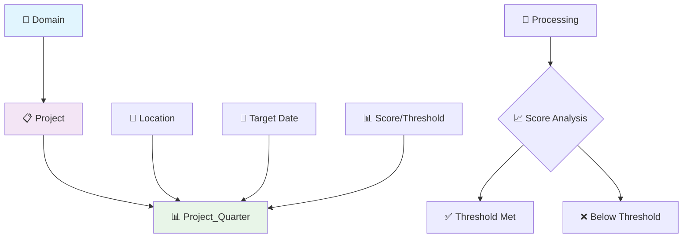

# PluginDB Database Schema

## 🤖 AI GUIDELINES FOR PLUGINDB DATABASE

**🎯 Primary Use**: Generate domain-isolated plugin data storage and processing code  
**🔐 Critical Rule**: All plugin data must be domain-scoped for multi-tenant isolation  
**⚡ Quick Start**: Use Entity Framework with domain filtering on every query  

### 🚨 CRITICAL FOR AI: Domain Isolation
```csharp
// ✅ ALWAYS filter by domain code
WHERE p.DomainCode = @domainCode
// ❌ NEVER query cross-domain plugin data
```

**🎯 AI Use Cases**:
- 📊 **Quarter Tracking**: Generate geographic completion calculations
- 🔄 **Data Processing**: Create domain-aware batch processing
- 📈 **Progress Analytics**: Build completion percentage reporting
- 🎯 **Plugin Storage**: Implement isolated plugin data patterns

## 🗄️ Database Overview

**Database**: PluginDB (SQL Server)  
**Purpose**: 📊 Domain-isolated plugin data storage (quarter completion **and** address-management projections)  
**Access Pattern**: 🔄 Full CRUD with mandatory domain filtering  
**Total Tables**: 11 (`quarter_completion` schema: 2, `dbo` schema: 1, `address_management` schema: 8)  
**Schema Type**: 🏗️ Plugin-specific schemas. Quarter completion is EF Core. Address projections are loaded by `pttn-address-projection` via `SqlBulkCopy`, not EF.  

### 🎯 AI Focus Areas
- **Geographic Analytics**: Quarter-based completion tracking with location data
- **Progress Monitoring**: Real-time project processing status and metrics
- **Domain Isolation**: Multi-tenant data separation at plugin level
- **Batch Processing**: Scalable data processing with audit trails  

## 🤖 AI Code Generation Quick Start

> 🔧 **Backend Implementation**: For technical implementation of plugin data access, see:
> - [`stack/dotnet/dotnet-patterns.md`](../stack/dotnet/dotnet-patterns.md) - Repository and service patterns for plugin data
> - [`stack/react/react-patterns.md`](../stack/react/react-patterns.md) - Frontend data consumption patterns

### 🔥 Most Common Operations
```csharp
// 📊 Domain-scoped project tracking with completion analytics
var projectAnalytics = await context.Projects
    .Include(p => p.ProjectQuarters)
    .Where(p => p.DomainCode == domainCode && p.Active)
    .Select(p => new ProjectAnalytics
    {
        ProjectId = p.Id,
        ProjectCode = p.Code,
        Campaign = p.Campaign,
        TotalQuarters = p.ProjectQuarters.Count(),
        CompletedQuarters = p.ProjectQuarters.Count(pq => pq.Score >= pq.Threshold),
        OverallCompletion = p.ProjectQuarters.Average(pq => (pq.Score / pq.Threshold) * 100),
        IsProcessing = p.Processing,
        LastUpdated = p.UpdatedAt
    })
    .ToListAsync();

// 🎯 Geographic completion percentage calculation
var locationStats = await context.ProjectQuarters
    .Where(pq => pq.Project.DomainCode == domainCode && pq.Project.Id == projectId)
    .GroupBy(pq => pq.LocationName)
    .Select(g => new LocationCompletion
    {
        LocationName = g.Key,
        TotalQuarters = g.Count(),
        CompletedQuarters = g.Count(pq => pq.Score >= pq.Threshold),
        CompletionPercentage = g.Average(pq => (pq.Score / pq.Threshold) * 100),
        HighestScore = g.Max(pq => pq.Score),
        LowestScore = g.Min(pq => pq.Score),
        AverageThreshold = g.Average(pq => pq.Threshold)
    })
    .OrderByDescending(lc => lc.CompletionPercentage)
    .ToListAsync();

// 🔄 Batch processing with domain isolation and audit trail
public async Task<ProcessingResult> StartProjectProcessingAsync(
    int projectId, string domainCode, string userEmail)
{
    var project = await context.Projects
        .FirstOrDefaultAsync(p => p.Id == projectId && p.DomainCode == domainCode);
    
    if (project == null)
        return ProcessingResult.NotFound($"Project {projectId} not found in domain {domainCode}");
    
    if (project.Processing)
        return ProcessingResult.Conflict($"Project {projectId} is already being processed");
    
    // Start processing with full audit trail
    project.Processing = true;
    project.ProcessingStartedAt = DateTime.UtcNow;
    project.ProcessingStartedBy = userEmail;
    project.UpdatedAt = DateTime.UtcNow;
    project.UpdatedBy = userEmail;
    
    await context.SaveChangesAsync();
    
    return ProcessingResult.Success($"Processing started for project {project.Code}");
}

// 📈 Real-time progress monitoring
var processingStatus = await context.Projects
    .Where(p => p.DomainCode == domainCode && p.Processing)
    .Select(p => new ProcessingStatus
    {
        ProjectId = p.Id,
        ProjectCode = p.Code,
        StartedAt = p.ProcessingStartedAt.Value,
        StartedBy = p.ProcessingStartedBy,
        ElapsedMinutes = (int)(DateTime.UtcNow - p.ProcessingStartedAt.Value).TotalMinutes,
        QuarterCount = p.ProjectQuarters.Count(),
        Method = p.Method
    })
    .ToListAsync();
```

## Table Schema Reference

### 1. quarter_completion.project
```csharp
public class Project
{
    public long Id { get; set; }                      // PK, Identity
    public string DomainCode { get; set; }            // NVARCHAR(450), Required - Domain isolation
    public string? Campaign { get; set; }             // NVARCHAR(MAX)
    public string Code { get; set; }                  // NVARCHAR(450), Required - Unique within domain
    public bool Active { get; set; }                  // BIT, Required
    public string Method { get; set; }                // NVARCHAR(MAX), Required - Calculation method
    public double ThresholdDefault { get; set; }      // FLOAT(53), Required - Default threshold
    public double ThresholdAB { get; set; }           // FLOAT(53), Required - A/B test threshold
    public string ScoreMethod { get; set; }           // NVARCHAR(MAX), Required - Scoring algorithm
    public string? Name { get; set; }                 // NVARCHAR(MAX)
    public DateTime CreatedAt { get; set; }           // DATETIME2, Default: '0001-01-01T00:00:00.0000000'
    public bool Processing { get; set; }              // BIT, Default: false
    public DateTime? ProcessingStartedAt { get; set; } // DATETIME2
    public DateTime? UpdatedAt { get; set; }          // DATETIME2
    
    // Navigation Properties
    public ICollection<ProjectQuarter> ProjectQuarters { get; set; }
}
```

### 2. quarter_completion.project_quarter
```csharp
public class ProjectQuarter
{
    public long Id { get; set; }                      // PK, Identity
    public long ProjectId { get; set; }               // FK to project.Id, Required
    public string LocationSEQNumber { get; set; }     // NVARCHAR(450), Required - Unique within project
    public string? LocationName { get; set; }         // NVARCHAR(MAX)
    public string? City { get; set; }                 // NVARCHAR(MAX)
    public string? Municipality { get; set; }         // NVARCHAR(MAX)
    public string? Province { get; set; }             // NVARCHAR(MAX)
    public long Addresses { get; set; }               // BIGINT, Required - Total address count
    public double Score { get; set; }                 // FLOAT(53), Required - Calculated score
    public double Threshold { get; set; }             // FLOAT(53), Required - Completion threshold
    public double Offset { get; set; }                // FLOAT(53), Required - Score adjustment
    public string Status { get; set; }                // NVARCHAR(MAX), Required
    
    // Navigation Properties
    public Project Project { get; set; }
}
```

### 3. dbo.__EFMigrationsHistory
Standard Entity Framework Core migrations table - no custom code needed.

### 4. address_management (pttn-address-projection)

Owned by `Briggs-Walker/pttn-address-projection`. Migrations live in that repository under `database/migrations/`. Access is `Microsoft.Data.SqlClient` + `SqlBulkCopy`, not EF Core. Every projection row is keyed by `DomainCodeProject` (and project / file / address as applicable).

| Table | Grain | Role |
| --- | --- | --- |
| `address_management.AddressStatusProjection` | Domain + Project + file + address business key | Per-address status (`untouched`, `missed`, `not found`, `notmatched`, `sale`, `nonsale`, `expired`, `attempted`) |
| `address_management.AddressFileOfficeProjection` | Domain + Project + file + office + location | File-overview counters |
| `address_management.AddressPoolProjection` | Domain + Project + address | Working-stock / last-contact pool |
| `address_management.AddressFileStatsProjection` | Domain + Project + file | File-level rollup |
| `address_management.BatchMetadata` | Run + batch | Nightly pickup bookkeeping |
| `address_management.ProjectionRunHistory` | Run | Nightly lock and outcome |
| `address_management.ProjectionRebuildState` | Singleton (`RebuildStateId = 1`) | Last successful rebuild watermark |
| `address_management.SchemaVersions` | Migration id | Idempotent migration ledger |

Do **not** write these tables from HTTP APIs. The worker is the writer. Consumers (address module / APIs) must still filter Domain → Account → Project → Office on user-facing reads. PTTN remains read-only for this path.

## Entity Framework DbContext

```csharp
public class QuarterCompletionContext : DbContext
{
    public DbSet<Project> Projects { get; set; }
    public DbSet<ProjectQuarter> ProjectQuarters { get; set; }
    
    protected override void OnModelCreating(ModelBuilder modelBuilder)
    {
        // Configure quarter_completion schema
        modelBuilder.HasDefaultSchema("quarter_completion");
        
        // Project configuration
        modelBuilder.Entity<Project>(entity =>
        {
            entity.ToTable("project", "quarter_completion");
            entity.HasKey(e => e.Id);
            entity.HasIndex(e => new { e.DomainCode, e.Code }).IsUnique();
            entity.Property(e => e.CreatedAt).HasDefaultValue(new DateTime(1, 1, 1));
            entity.Property(e => e.Processing).HasDefaultValue(false);
        });
        
        // ProjectQuarter configuration
        modelBuilder.Entity<ProjectQuarter>(entity =>
        {
            entity.ToTable("project_quarter", "quarter_completion");
            entity.HasKey(e => e.Id);
            entity.HasIndex(e => new { e.ProjectId, e.LocationSEQNumber }).IsUnique();
            entity.HasOne(e => e.Project)
                  .WithMany(p => p.ProjectQuarters)
                  .HasForeignKey(e => e.ProjectId)
                  .OnDelete(DeleteBehavior.Cascade);
        });
    }
}
```

## Common Queries for AI Generation

### Project Management Queries
```csharp
// Get active projects for domain with quarter summary
var projectSummary = await context.Projects
    .Where(p => p.DomainCode == domainCode && p.Active)
    .Select(p => new
    {
        p.Id,
        p.Code,
        p.Name,
        p.Campaign,
        p.ThresholdDefault,
        QuarterCount = p.ProjectQuarters.Count(),
        CompletedQuarters = p.ProjectQuarters.Count(pq => pq.Score >= pq.Threshold),
        TotalAddresses = p.ProjectQuarters.Sum(pq => pq.Addresses),
        AverageScore = p.ProjectQuarters.Average(pq => pq.Score),
        p.Processing,
        p.ProcessingStartedAt
    })
    .ToListAsync();

// Get project by code within domain
var project = await context.Projects
    .Include(p => p.ProjectQuarters)
    .FirstOrDefaultAsync(p => p.DomainCode == domainCode && p.Code == projectCode);
```

### Quarter Completion Analysis
```csharp
// Get completion status by geographic hierarchy
var geographicCompletion = await context.ProjectQuarters
    .Where(pq => pq.Project.DomainCode == domainCode && pq.Project.Active)
    .GroupBy(pq => new { pq.Province, pq.Municipality, pq.City })
    .Select(g => new
    {
        g.Key.Province,
        g.Key.Municipality,
        g.Key.City,
        TotalQuarters = g.Count(),
        TotalAddresses = g.Sum(pq => pq.Addresses),
        CompletedQuarters = g.Count(pq => pq.Score >= pq.Threshold),
        AverageScore = g.Average(pq => pq.Score),
        CompletionPercentage = (double)g.Count(pq => pq.Score >= pq.Threshold) / g.Count() * 100
    })
    .OrderBy(x => x.Province)
    .ThenBy(x => x.Municipality)
    .ThenBy(x => x.City)
    .ToListAsync();

// Get quarter details for specific project
var quarterDetails = await context.ProjectQuarters
    .Where(pq => pq.ProjectId == projectId)
    .Select(pq => new
    {
        pq.LocationSEQNumber,
        pq.LocationName,
        pq.City,
        pq.Municipality,
        pq.Province,
        pq.Addresses,
        pq.Score,
        pq.Threshold,
        pq.Status,
        CompletionPercentage = (pq.Score / pq.Threshold) * 100,
        IsComplete = pq.Score >= pq.Threshold
    })
    .OrderBy(x => x.Province)
    .ThenBy(x => x.Municipality)
    .ThenBy(x => x.City)
    .ToListAsync();
```

### Processing Status Management
```csharp
// Start project processing
public async Task<bool> StartProjectProcessingAsync(long projectId)
{
    var project = await context.Projects.FindAsync(projectId);
    if (project == null || project.Processing) return false;
    
    project.Processing = true;
    project.ProcessingStartedAt = DateTime.UtcNow;
    project.UpdatedAt = DateTime.UtcNow;
    
    await context.SaveChangesAsync();
    return true;
}

// Complete project processing
public async Task<bool> CompleteProjectProcessingAsync(long projectId)
{
    var project = await context.Projects.FindAsync(projectId);
    if (project == null || !project.Processing) return false;
    
    project.Processing = false;
    project.ProcessingStartedAt = null;
    project.UpdatedAt = DateTime.UtcNow;
    
    await context.SaveChangesAsync();
    return true;
}

// Get currently processing projects
var processingProjects = await context.Projects
    .Where(p => p.Processing && p.ProcessingStartedAt.HasValue)
    .Select(p => new
    {
        p.Id,
        p.Code,
        p.Name,
        p.DomainCode,
        p.ProcessingStartedAt,
        ProcessingMinutes = EF.Functions.DateDiffMinute(p.ProcessingStartedAt.Value, DateTime.UtcNow)
    })
    .ToListAsync();
```

## Repository Pattern Examples

### IProjectRepository
```csharp
public interface IProjectRepository
{
    Task<Project?> GetByIdAsync(long id);
    Task<Project?> GetByCodeAsync(string domainCode, string code);
    Task<IEnumerable<Project>> GetByDomainAsync(string domainCode, bool activeOnly = true);
    Task<Project> CreateAsync(Project project);
    Task UpdateAsync(Project project);
    Task<bool> StartProcessingAsync(long projectId);
    Task<bool> CompleteProcessingAsync(long projectId);
}

public class ProjectRepository : IProjectRepository
{
    private readonly QuarterCompletionContext _context;
    
    public ProjectRepository(QuarterCompletionContext context)
    {
        _context = context;
    }
    
    public async Task<Project?> GetByCodeAsync(string domainCode, string code)
    {
        return await _context.Projects
            .Include(p => p.ProjectQuarters)
            .FirstOrDefaultAsync(p => p.DomainCode == domainCode && p.Code == code);
    }
    
    public async Task<IEnumerable<Project>> GetByDomainAsync(string domainCode, bool activeOnly = true)
    {
        var query = _context.Projects
            .Include(p => p.ProjectQuarters)
            .Where(p => p.DomainCode == domainCode);
            
        if (activeOnly)
            query = query.Where(p => p.Active);
            
        return await query.OrderByDescending(p => p.CreatedAt).ToListAsync();
    }
    
    public async Task<bool> StartProcessingAsync(long projectId)
    {
        var project = await _context.Projects.FindAsync(projectId);
        if (project == null || project.Processing) return false;
        
        project.Processing = true;
        project.ProcessingStartedAt = DateTime.UtcNow;
        project.UpdatedAt = DateTime.UtcNow;
        
        await _context.SaveChangesAsync();
        return true;
    }
}
```

### IQuarterCompletionRepository
```csharp
public interface IQuarterCompletionRepository
{
    Task<IEnumerable<ProjectQuarter>> GetQuartersByProjectAsync(long projectId);
    Task<IEnumerable<GeographicCompletion>> GetCompletionByGeographyAsync(string domainCode);
    Task<CompletionSummary> GetProjectSummaryAsync(long projectId);
    Task UpdateQuarterScoreAsync(long quarterId, double score, double threshold);
}

public class QuarterCompletionRepository : IQuarterCompletionRepository
{
    private readonly QuarterCompletionContext _context;
    
    public QuarterCompletionRepository(QuarterCompletionContext context)
    {
        _context = context;
    }
    
    public async Task<IEnumerable<GeographicCompletion>> GetCompletionByGeographyAsync(string domainCode)
    {
        return await _context.ProjectQuarters
            .Where(pq => pq.Project.DomainCode == domainCode && pq.Project.Active)
            .GroupBy(pq => new { pq.Province, pq.Municipality, pq.City })
            .Select(g => new GeographicCompletion
            {
                Province = g.Key.Province,
                Municipality = g.Key.Municipality,
                City = g.Key.City,
                TotalQuarters = g.Count(),
                TotalAddresses = g.Sum(pq => pq.Addresses),
                CompletedQuarters = g.Count(pq => pq.Score >= pq.Threshold),
                AverageScore = g.Average(pq => pq.Score),
                CompletionPercentage = (double)g.Count(pq => pq.Score >= pq.Threshold) / g.Count() * 100
            })
            .ToListAsync();
    }
    
    public async Task<CompletionSummary> GetProjectSummaryAsync(long projectId)
    {
        var project = await _context.Projects
            .Include(p => p.ProjectQuarters)
            .FirstOrDefaultAsync(p => p.Id == projectId);
            
        if (project == null) return null;
        
        return new CompletionSummary
        {
            ProjectId = project.Id,
            ProjectCode = project.Code,
            ProjectName = project.Name,
            TotalQuarters = project.ProjectQuarters.Count,
            CompletedQuarters = project.ProjectQuarters.Count(pq => pq.Score >= pq.Threshold),
            TotalAddresses = project.ProjectQuarters.Sum(pq => pq.Addresses),
            AverageScore = project.ProjectQuarters.Average(pq => pq.Score),
            CompletionPercentage = project.ProjectQuarters.Count > 0 
                ? (double)project.ProjectQuarters.Count(pq => pq.Score >= pq.Threshold) / project.ProjectQuarters.Count * 100 
                : 0
        };
    }
}
```

## Service Layer Examples

### QuarterCompletionService
```csharp
public class QuarterCompletionService
{
    private readonly IProjectRepository _projectRepository;
    private readonly IQuarterCompletionRepository _quarterRepository;
    
    public QuarterCompletionService(
        IProjectRepository projectRepository,
        IQuarterCompletionRepository quarterRepository)
    {
        _projectRepository = projectRepository;
        _quarterRepository = quarterRepository;
    }
    
    public async Task<CompletionAnalysis> AnalyzeProjectCompletionAsync(string domainCode, string projectCode)
    {
        var project = await _projectRepository.GetByCodeAsync(domainCode, projectCode);
        if (project == null) return null;
        
        var summary = await _quarterRepository.GetProjectSummaryAsync(project.Id);
        var quarters = await _quarterRepository.GetQuartersByProjectAsync(project.Id);
        
        return new CompletionAnalysis
        {
            Project = project,
            Summary = summary,
            QuarterDetails = quarters.Select(q => new QuarterDetail
            {
                LocationName = q.LocationName,
                CompletionPercentage = (q.Score / q.Threshold) * 100,
                IsComplete = q.Score >= q.Threshold,
                AddressCount = q.Addresses,
                Status = q.Status
            }).ToList()
        };
    }
    
    public async Task<bool> ProcessProjectAsync(string domainCode, string projectCode)
    {
        var project = await _projectRepository.GetByCodeAsync(domainCode, projectCode);
        if (project == null || project.Processing) return false;
        
        var started = await _projectRepository.StartProcessingAsync(project.Id);
        if (!started) return false;
        
        try
        {
            // Perform quarter completion calculations
            await CalculateQuarterCompletionAsync(project.Id);
            
            await _projectRepository.CompleteProcessingAsync(project.Id);
            return true;
        }
        catch
        {
            await _projectRepository.CompleteProcessingAsync(project.Id);
            throw;
        }
    }
    
    private async Task CalculateQuarterCompletionAsync(long projectId)
    {
        // Implementation for quarter completion calculation logic
        // This would involve business rules for scoring and threshold comparisons
    }
}
```

## Model Classes

### Supporting Models
```csharp
public class GeographicCompletion
{
    public string? Province { get; set; }
    public string? Municipality { get; set; }
    public string? City { get; set; }
    public int TotalQuarters { get; set; }
    public long TotalAddresses { get; set; }
    public int CompletedQuarters { get; set; }
    public double AverageScore { get; set; }
    public double CompletionPercentage { get; set; }
}

public class CompletionSummary
{
    public long ProjectId { get; set; }
    public string ProjectCode { get; set; }
    public string? ProjectName { get; set; }
    public int TotalQuarters { get; set; }
    public int CompletedQuarters { get; set; }
    public long TotalAddresses { get; set; }
    public double AverageScore { get; set; }
    public double CompletionPercentage { get; set; }
}

public class CompletionAnalysis
{
    public Project Project { get; set; }
    public CompletionSummary Summary { get; set; }
    public List<QuarterDetail> QuarterDetails { get; set; }
}

public class QuarterDetail
{
    public string? LocationName { get; set; }
    public double CompletionPercentage { get; set; }
    public bool IsComplete { get; set; }
    public long AddressCount { get; set; }
    public string Status { get; set; }
}
```

## AI Development Guidelines

### When to Use This Database
- **Quarter completion tracking** for fundraising campaigns
- **Geographic analysis** of completion rates
- **Project processing status** monitoring
- **A/B testing** with different thresholds

### Code Generation Best Practices
1. **Always filter by DomainCode** for multi-tenant isolation
2. **Use async/await** for all database operations
3. **Include navigation properties** for efficient data loading
4. **Handle processing status** with proper state management
5. **Implement geographic grouping** for reporting
6. **Use transactions** for score updates with status changes

### Common Patterns
- **Domain isolation**: Always filter projects by DomainCode
- **Processing workflow**: Start → Calculate → Complete with error handling
- **Geographic hierarchy**: Province → Municipality → City grouping
- **Completion calculation**: Score/Threshold comparison with percentage

## Connection String Configuration

```json
{
  "ConnectionStrings": {
    "PluginDB": "Server=sqlserver;Database=plugindb;uid=quartercompletionapi;Password=***;MultipleActiveResultSets=True"
  }
}
```

## 🔗 Plugin Data Relationships & Processing Flow

### 📊 Quarter Completion Data Model


### 🎯 AI Use Case: Completion Analytics Engine
```csharp
// Generate comprehensive completion analytics
public async Task<CompletionAnalytics> GenerateCompletionAnalyticsAsync(
    string domainCode, int? projectId = null)
{
    var baseQuery = context.Projects
        .Include(p => p.ProjectQuarters)
        .Where(p => p.DomainCode == domainCode && p.Active);
    
    if (projectId.HasValue)
        baseQuery = baseQuery.Where(p => p.Id == projectId.Value);
    
    var projects = await baseQuery.ToListAsync();
    
    return new CompletionAnalytics
    {
        DomainCode = domainCode,
        AnalysisDate = DateTime.UtcNow,
        TotalProjects = projects.Count,
        ProjectSummaries = projects.Select(p => new ProjectSummary
        {
            ProjectId = p.Id,
            ProjectCode = p.Code,
            Campaign = p.Campaign,
            Method = p.Method,
            TotalQuarters = p.ProjectQuarters.Count,
            CompletedQuarters = p.ProjectQuarters.Count(pq => pq.Score >= pq.Threshold),
            CompletionPercentage = p.ProjectQuarters.Any() 
                ? (p.ProjectQuarters.Count(pq => pq.Score >= pq.Threshold) * 100.0) / p.ProjectQuarters.Count
                : 0,
            LocationBreakdown = p.ProjectQuarters
                .GroupBy(pq => pq.LocationName)
                .Select(g => new LocationSummary
                {
                    LocationName = g.Key,
                    QuarterCount = g.Count(),
                    CompletedCount = g.Count(pq => pq.Score >= pq.Threshold),
                    AverageScore = g.Average(pq => pq.Score),
                    AverageThreshold = g.Average(pq => pq.Threshold)
                })
                .ToList()
        }).ToList(),
        OverallCompletion = projects.SelectMany(p => p.ProjectQuarters).Any()
            ? (projects.SelectMany(p => p.ProjectQuarters).Count(pq => pq.Score >= pq.Threshold) * 100.0) 
              / projects.SelectMany(p => p.ProjectQuarters).Count()
            : 0
    };
}
```

## 🛡️ Business Rules & Data Validation

### 🚨 CRITICAL BUSINESS RULES FOR AI

#### 🔐 Domain Isolation Rules
```csharp
// ✅ All plugin data must be domain-scoped
public class DomainIsolationValidator
{
    public async Task<ValidationResult> ValidateDataAccessAsync(
        string userDomain, string requestedDomain)
    {
        if (userDomain != requestedDomain)
            return ValidationResult.Error(
                $"Cross-domain access denied: {userDomain} cannot access {requestedDomain}");
        
        return ValidationResult.Success();
    }
    
    // ✅ Project processing must validate domain ownership
    public async Task<ValidationResult> ValidateProcessingRightsAsync(
        int projectId, string domainCode, string userEmail)
    {
        var project = await context.Projects
            .FirstOrDefaultAsync(p => p.Id == projectId && p.DomainCode == domainCode);
        
        if (project == null)
            return ValidationResult.Error(
                $"Project {projectId} not found in domain {domainCode}");
        
        // Additional user permission validation would go here
        // Based on integration with PTTN authorization system
        
        return ValidationResult.Success();
    }
}
```

#### 📊 Quarter Completion Rules
```csharp
// ✅ Score and threshold validation
public class QuarterCompletionValidator
{
    public ValidationResult ValidateQuarterData(ProjectQuarter quarter)
    {
        var errors = new List<string>();
        
        if (quarter.Score < 0)
            errors.Add("Score cannot be negative");
        
        if (quarter.Threshold <= 0)
            errors.Add("Threshold must be positive");
        
        if (string.IsNullOrWhiteSpace(quarter.LocationName))
            errors.Add("Location name is required");
        
        if (quarter.TargetDate < DateTime.UtcNow.Date)
            errors.Add("Target date cannot be in the past");
        
        return errors.Any() 
            ? ValidationResult.Error(string.Join("; ", errors))
            : ValidationResult.Success();
    }
    
    // ✅ Project processing state validation
    public async Task<ValidationResult> ValidateProcessingStateAsync(int projectId)
    {
        var project = await context.Projects.FindAsync(projectId);
        
        if (project == null)
            return ValidationResult.Error($"Project {projectId} not found");
        
        if (!project.Active)
            return ValidationResult.Error($"Cannot process inactive project {projectId}");
        
        if (project.Processing)
            return ValidationResult.Error(
                $"Project {projectId} is already being processed since {project.ProcessingStartedAt}");
        
        return ValidationResult.Success();
    }
}
```

## ⚡ Performance Guidelines

### ✅ Recommended Patterns
- **Domain Filtering**: Always filter by domain at query level
- **Batch Processing**: Process multiple quarters in single transaction
- **Completion Caching**: Cache completion percentages for 15 minutes
- **Location Grouping**: Use efficient grouping for location analytics

### ❌ Performance Anti-Patterns
- **Cross-domain queries**: Never query multiple domains simultaneously
- **N+1 quarter loading**: Always use Include() for quarter data
- **Unbounded analytics**: Always limit date ranges for analytics
- **Real-time calculations**: Cache intensive completion calculations

### 🔍 Critical Indexes for Plugin Operations
```sql
-- Domain-project lookup optimization
CREATE INDEX IX_Project_Domain_Active 
ON quarter_completion.project (domain_code, active)
INCLUDE (id, code, campaign, method);

-- Quarter completion analysis optimization
CREATE INDEX IX_ProjectQuarter_Project_Location 
ON quarter_completion.project_quarter (project_id, location_name)
INCLUDE (score, threshold, target_date);

-- Processing status lookup
CREATE INDEX IX_Project_Processing_Status
ON quarter_completion.project (processing, processing_started_at)
INCLUDE (domain_code, code, processing_started_by);
```

## 🤖 AI Code Generation Templates

### 📊 Analytics Service Template
```csharp
// Generate analytics service for any plugin data
public class PluginAnalyticsTemplate
{
    public string GenerateAnalyticsService(string pluginName, string entityName)
    {
        return $@"
// Auto-generated analytics service for {pluginName}
public interface I{entityName}AnalyticsService
{{
    Task<{entityName}Analytics> GetDomainAnalyticsAsync(string domainCode);
    Task<{entityName}Summary> GetEntitySummaryAsync(int entityId, string domainCode);
    Task<IEnumerable<{entityName}Trend>> GetTrendDataAsync(string domainCode, DateRange range);
}}

public class {entityName}AnalyticsService : I{entityName}AnalyticsService
{{
    private readonly PluginDbContext _context;
    private readonly IMemoryCache _cache;
    
    public {entityName}AnalyticsService(PluginDbContext context, IMemoryCache cache)
    {{
        _context = context;
        _cache = cache;
    }}
    
    public async Task<{entityName}Analytics> GetDomainAnalyticsAsync(string domainCode)
    {{
        var cacheKey = $""{entityName.ToLower()}_analytics_{{domainCode}}"";
        
        if (_cache.TryGetValue(cacheKey, out {entityName}Analytics cached))
            return cached;
        
        var analytics = await Calculate{entityName}AnalyticsAsync(domainCode);
        
        _cache.Set(cacheKey, analytics, TimeSpan.FromMinutes(15));
        return analytics;
    }}
    
    private async Task<{entityName}Analytics> Calculate{entityName}AnalyticsAsync(string domainCode)
    {{
        // Domain-specific analytics calculation
        // Always include domain filtering
        var entities = await _context.{entityName}s
            .Where(e => e.DomainCode == domainCode && e.Active)
            .ToListAsync();
        
        return new {entityName}Analytics
        {{
            DomainCode = domainCode,
            TotalCount = entities.Count,
            // Additional analytics calculations...
        }};
    }}
}}";
    }
}
```

### 🔄 Batch Processing Template
```csharp
// Generate batch processing for plugin data
public class BatchProcessingTemplate
{
    public string GenerateBatchProcessor(string entityName)
    {
        return $@"
// Auto-generated batch processor for {entityName}
public class {entityName}BatchProcessor
{{
    private readonly PluginDbContext _context;
    private readonly ILogger<{entityName}BatchProcessor> _logger;
    
    public async Task<BatchResult> ProcessBatchAsync(
        IEnumerable<{entityName}> entities, string domainCode, string userEmail)
    {{
        var results = new List<ProcessingResult>();
        
        using var transaction = await _context.Database.BeginTransactionAsync();
        
        try
        {{
            foreach (var entity in entities)
            {{
                // 🚨 CRITICAL: Validate domain for each entity
                if (entity.DomainCode != domainCode)
                {{
                    results.Add(ProcessingResult.Error(
                        $""Entity {{entity.Id}} domain mismatch: {{entity.DomainCode}} != {{domainCode}}""));
                    continue;
                }}
                
                var result = await ProcessSingleEntityAsync(entity, userEmail);
                results.Add(result);
            }}
            
            if (results.All(r => r.Success))
            {{
                await transaction.CommitAsync();
                _logger.LogInformation(""Batch processing completed successfully for {{Count}} entities in domain {{Domain}}"",
                    entities.Count(), domainCode);
            }}
            else
            {{
                await transaction.RollbackAsync();
                _logger.LogWarning(""Batch processing failed for domain {{Domain}}. {{FailCount}} failures."",
                    domainCode, results.Count(r => !r.Success));
            }}
            
            return new BatchResult
            {{
                TotalProcessed = entities.Count(),
                Successful = results.Count(r => r.Success),
                Failed = results.Count(r => !r.Success),
                Results = results
            }};
        }}
        catch (Exception ex)
        {{
            await transaction.RollbackAsync();
            _logger.LogError(ex, ""Batch processing failed for domain {{Domain}}"", domainCode);
            throw;
        }}
    }}
}}";
    }
}
```
