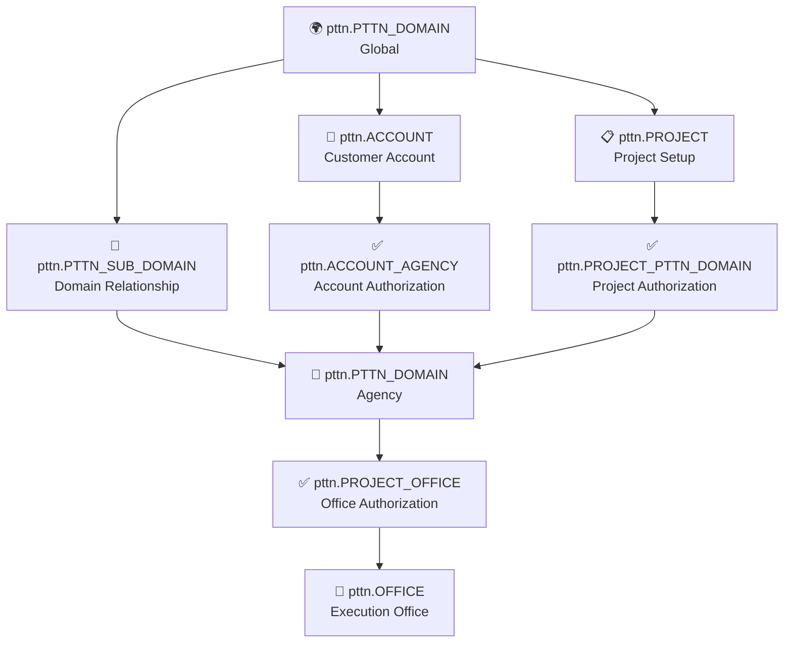
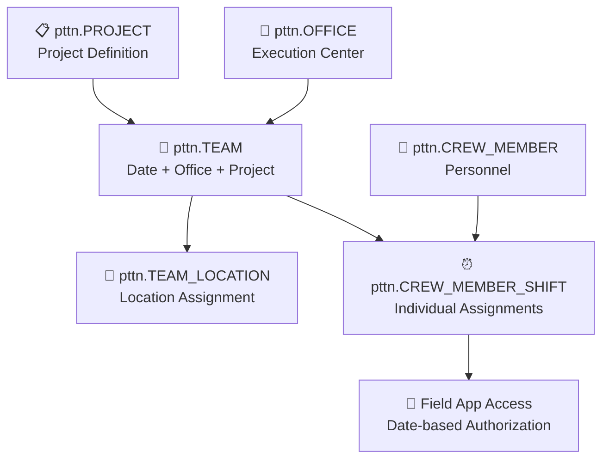
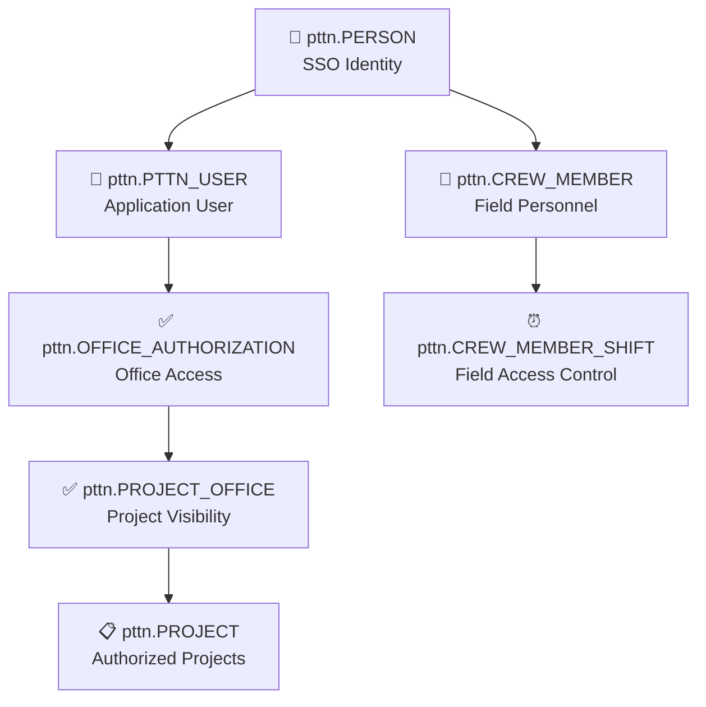
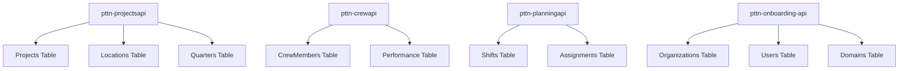

# PTTN Database Schema

**🤖 AI AGENT QUICK REFERENCE**: This is the core ERP database schema for the Briggs System. Use this reference for generating queries, models, and understanding data relationships.

## 🔑 Critical AI Guidelines
- **ALWAYS validate 4-level authorization chain** for agency domain queries
- **ALWAYS include DOMAIN_CODE filtering** in WHERE clauses
- **ALWAYS check YN_ACTIVE = 'YES'** for active records
- **Field app access requires active shift on current date**
- **Use authorization queries from examples below**

## Database Overview

**Database Name**: PTTN  
**Type**: SQL Server  
**Purpose**: Core ERP system data storage (monolithic)  
**Access Pattern**: Direct reads, controlled writes via Rulesengine API  

## 📊 Schema Documentation Status

✅ **Schema extraction completed**: Database schema successfully extracted on 2025-06-14. This documentation reflects the actual table structures in the PTTN database.

**Total Tables**: 584 tables across 3 schemas (pttn, dbo, cdc)
**Generated**: 2025-06-14 22:58:53
**Source**: `/docs/dbdump/pttn/tableschemas/`

### Key Schema Statistics
- **pttn schema**: 577 tables - Core business logic and operational data
- **dbo schema**: 4 tables - System and utility tables  
- **cdc schema**: 7 tables - Change Data Capture for event tracking

## 🏗️ Domain Areas & Core Tables

### 🌍 Multi-Tenant Domain Management
**🎯 AI Use Case**: Domain isolation, authorization validation, tenant scoping

**Core Concept**: The system operates as a multi-tenant environment where all data is logically isolated by domain. Each domain is specific to a country and can be either a 'Global domain' (organizer) or 'Agency domain' (executor).

**🔗 Core Tables**:
- `pttn.PTTN_DOMAIN` - Domain definitions with country-specific configurations (45+ columns)
- `pttn.PTTN_SUB_DOMAIN` - Relationships between global and agency domains
- `pttn.PTTN_USER` - Application users with domain-scoped permissions (37 columns)
- `pttn.PERSON` - Single sign-on identity linking multiple user accounts

### 🏢 Account & Campaign Hierarchy
**🎯 AI Use Case**: Business entity relationships, hierarchical data queries

**Business Flow**: Account → Campaign → Project → Execution

**🔗 Core Tables**:
- `pttn.ACCOUNT` - Customer accounts and organization data (42 columns)
- `pttn.ACCOUNT_TYPE` - Account classification types
- `pttn.ACCOUNT_AGENCY` - Agency authorization to work on accounts
- `pttn.CAMPAIGN` - Campaign master data with brand cluster definitions
- `pttn.CAMPAIGN_PRODUCT` - Product assignments to campaigns
- `pttn.BRAND_CLUSTER` - Preset list of sectors that can be serviced

### 🎯 Project Management & Authorization
**🎯 AI Use Case**: Project access control, authorization chain validation

**Authorization Hierarchy**: 4-level authorization model for project access
1. **Domain Level**: `pttn.PTTN_SUB_DOMAIN` - Agency authorized for global domain
2. **Account Level**: `pttn.ACCOUNT_AGENCY` - Agency authorized for specific accounts
3. **Project Level**: `pttn.PROJECT_PTTN_DOMAIN` - Agency authorized for specific projects
4. **Office Level**: `pttn.PROJECT_OFFICE` - Office authorized for project execution

**🔗 Core Tables**:
- `pttn.PROJECT` - Project definitions and configuration (43+ columns)
- `pttn.PROJECT_PTTN_DOMAIN` - Project authorization for agency domains
- `pttn.PROJECT_OFFICE` - Office-level project authorizations
- `pttn.PROJECT_LOCATION` - Project geographical assignments
- `pttn.PROJECT_ADDRESS` - Address targeting for projects
- `pttn.PROJECT_ADDRESS_IMPORT_BATCH` - Address-file import batches (domain + project + file); source for the nightly address projection
- `pttn.PROJECT_ADDRESS_IMPORT` - Per-row import payload for a batch
- `pttn.PROJECT_ADDRESS_IMP_EXTERNAL` - External include/exclude address import rows. `DWH` KPN/KPNZ jobs currently INSERT this table directly; application writes must still go through Rulesengine
- `pttn.PROJECT_RESULT` - Project outcome tracking

### ⏰ Team-Based Execution Model
**🎯 AI Use Case**: Shift scheduling, field app access control, team management

**Core Concept**: Execution is organized around 'shifts' - one person, one day, one project, one office

**🔗 Core Tables**:
- `pttn.TEAM` - Team definitions with date, office, and project assignments (42 columns)
- `pttn.TEAM_LOCATION` - Location assignments for teams
- `pttn.CREW_MEMBER` - Crew member profiles and personal data (35 columns)
- `pttn.CREW_MEMBER_SHIFT` - Individual shift assignments with authorization control
- `pttn.CREW_MEMBER_PROJECT` - Crew assignments to projects
- `pttn.OFFICE` - Office management and coordination centers
- `pttn.OFFICE_AUTHORIZATION` - User authorization per office

### 👥 User Authorization & Access Control
**🎯 AI Use Case**: User permission validation, role-based access control

**User Types**:
- **Application Users**: Access to Location Manager and Campaign Manager (office staff)
- **Crew Members**: Access to Field app only (execution personnel)

**Permission Structure**:
- `pttn.PTTN_USER` - Application users with granular YN_* permissions
- `pttn.OFFICE_AUTHORIZATION` - Office-based access control
- Field app access controlled by active, non-completed shifts for current date

**Key Authorization Fields in PTTN_USER**:
- `YN_ACCOUNTS`, `YN_PROJECTS`, `YN_CREW`, `YN_PLANNING`, `YN_RESULTS`
- `YN_DASHBOARD`, `YN_SETTINGS`, `YN_LOCATION_MANAGEMENT`

### 📍 Address & Contact Management
**🎯 AI Use Case**: Geographic data queries, contact tracking, country-specific addressing

**🔗 Core Tables** (Country-specific):
- `pttn.ADDRESS_NL` - Netherlands address data (the `pttn-address-projection` worker currently joins this table only)
- `pttn.ADDRESS_BE` - Belgium address data  
- `pttn.ADDRESS_FR` - France address data
- `pttn.ADDRESS_DE` - Germany address data
- `pttn.ADDRESS_UK` - United Kingdom address data
- `pttn.ADDRESS_CONTACT` - Contact attempt tracking (`DOMAIN_CODE_PROJECT`, `PROJECT_CODE_PROJECT`, `DOMAIN_CODE_OFFICE`)
- `pttn.ADDRESS_CONTACT_RESULT_CODE` - Contact outcome classifications
- **Read model**: `pttn-address-projection` rebuilds `plugindb.address_management.*` from these tables. PTTN access is **read-only** and domain-scoped (`DOMAIN_CODE_PROJECT IN` active `briggs-address-module` domains). Writes stay on PluginDB, not PTTN.

## ⚡ Critical Business Rules & Authorization Patterns

### 🔒 Domain-Based Multi-Tenancy
**🚨 CRITICAL FOR AI**: Every query MUST include domain filtering
- **All data is domain-scoped**: Every record has a `DOMAIN_CODE` field for logical isolation
- **Country-specific domains**: Each domain represents one country
- **Global vs Agency domains**: Global domains organize, Agency domains execute
- **Special relationships**: When agency = global, `YN_SPECIAL_RELATION = 'YES'` in `PTTN_SUB_DOMAIN`

### 🔐 4-Level Project Authorization Chain
**🚨 CRITICAL FOR AI**: All 4 levels must be validated for agency access

**4-Level Authorization Model** (all controlled by global domain, except #4):

1. **`PTTN_SUB_DOMAIN`**: Agency authorized for global domain
   - Links `DOMAIN_CODE_GLOBAL` to `DOMAIN_CODE_AGENCY`
   - Must exist for any collaboration between domains

2. **`ACCOUNT_AGENCY`**: Agency authorized for specific account
   - Links agency domain to customer accounts
   - Required before project-level access

3. **`PROJECT_PTTN_DOMAIN`**: Agency authorized for specific project
   - Links `PROJECT_CODE` with executing agency domain
   - Enables project visibility to agency

4. **`PROJECT_OFFICE`**: Office authorized for project execution
   - Controlled by agency domain (not global)
   - Determines which offices can plan and execute

### 👤 User Access Patterns
**🚨 CRITICAL FOR AI**: Different query patterns based on user type

**Global Domain Users**: See all accounts/campaigns/projects in their domain

**Agency Domain Users**: 
- **Account Managers** (sufficient rights): See all accounts/projects agency is authorized for
- **Office Personnel** (limited rights): See only projects where their authorized office is active

**Authorization Control**:
- Office authorization: `OFFICE_AUTHORIZATION` table determines office access per user
- Project visibility: Based on `PROJECT_OFFICE` authorizations for user's offices
- All controlled by `YN_ACTIVE` flags throughout the authorization chain

### ⏰ Shift-Based Field Access
**🚨 CRITICAL FOR AI**: Field app access requires active shift for current date
- `CREW_MEMBER_SHIFT` with `YN_ACTIVE = 'YES'` and `YN_COMPLETED = 'NO'`
- Team date (`TEAM.DDATE`) must match current date
- Team must be active (`TEAM.YN_ACTIVE = 'YES'`)
- Closing shift denies future Field app access

## 🔄 Authorization Flow Diagrams

### Multi-Tenant Authorization Flow

### Team & Shift Execution Flow

### User Authorization Model

## 📊 Additional Domain Areas

### Data Warehousing & Analytics
**🎯 AI Use Case**: Historical reporting, performance analysis
**🔗 Core Tables**:
- `pttn.DWH_PROJECT` - Data warehouse project snapshots
- `pttn.DWH_CREW_MEMBER` - Historical crew member data
- `pttn.DWH_CREW_MEMBER_SHIFT` - Shift performance analytics
- `pttn.DWH_CREW_MEMBER_SHIFT_RESULT` - Result aggregations
- `pttn.DWH_DOMAIN` - Domain analytics data
- `pttn.DWH_DOMAIN_RESULT_CODE` / `pttn.dwh_domain_result_code` - Result code performance tracking (read by `DWH` `PollDWHDomainResultCode`)
- `pttn.dwh_domain_churn_phase` - Churn-phase snapshots (read by `DWH` `PollDWHDomainChurnPhase`)
- `pttn.dwh_addr_cont_result_code_hist` - Address-contact result history (read by `DWH` `PollDWHAddrContResultCodeHistory`)
- `pttn.DWH_CREW_MEMBER_DASHBOARD` - Shift dashboard rows (read by `DWH` `PttnCrewDashboardController`)
- PTTN-side views named `dwh8_*` (for example `dwh8_shifts`) are the SQL Server source for Laravel poll jobs that copy into MySQL `dwh8`. That MySQL warehouse is owned by `Briggs-Walker/DWH` and is not this schema.

### Geographic Data Management
**🎯 AI Use Case**: Location-based queries, spatial analysis
**🔗 Core Tables**:
- `pttn.ADDRESS_GEOMETRY_*` - Spatial/geometric data per country
- `pttn.ADDRESS_LANGUAGE_BE` - Language preferences in Belgium
- `pttn.ADDRESS_FORMATING_AU` - Address formatting rules for Australia
- `pttn.ADDRESS_USE_TYPE` - Address usage classifications

### Form & Survey Management
**🎯 AI Use Case**: Dynamic form handling, survey responses
**🔗 Core Tables**:
- `pttn.FORM_*` - Dynamic form definitions and responses
- `pttn.SURVEY_*` - Survey configurations and results
- `pttn.QUESTION_*` - Question definitions and answer tracking

### Payment & Financial
**🎯 AI Use Case**: Payment processing, financial reporting
**🔗 Core Tables**:
- `pttn.SEPA_*` - SEPA payment processing
- `pttn.PAYMENT_*` - Payment method configurations
- `pttn.DONATION_*` - Donation amount tracking

### Change Data Capture (CDC)
**🎯 AI Use Case**: Event tracking, audit trails
**🔗 Core Tables**:
- `cdc.captured_columns` - CDC column configuration
- `cdc.change_tables` - CDC table tracking
- `cdc.pttn_TOPIC_EVENT_CT` - Event change tracking read by `cdc-pttn`
- `cdc.lsn_time_mapping` - Log sequence number mappings
- `dbo.cdc_offset_tracker` - operational single-row LSN watermark used by `cdc-pttn` (not a business table; not a Rulesengine write)

## 🚀 Data Access Services

### Services with Direct PTTN Access
- **pttn-projectsapi**: Projects, Locations, Quarters, Performance data
- **pttn-crewapi**: CrewMembers, Performance, Marketing data  
- **pttn-planningapi** (alias `pttn-planning-api`): Shifts, Assignments, Teams, Schedules
- **pttn-onboarding-api**: Organizations, Users, Domains, Configuration
- **cdc-pttn**: reads `cdc.pttn_TOPIC_EVENT_CT`; writes only `dbo.cdc_offset_tracker` (watermark). Not an application PTTN write path and not a Rulesengine client. `cdc-agencysuite` is AgencySuite-only and is not a PTTN access service
- **pttn-authapi**: read-only grant lookups (`PERSON`, `PTTN_USER`, `PTTN_DOMAIN`, `PROJECT`, `PROJECT_OFFICE`, `OFFICE_AUTHORIZATION`, `PTTN_SUB_DOMAIN`, `ACCOUNT_AGENCY`). `PTTN_DOMAIN.API_TOKEN` is a legacy domain lookup, not JWT. Agency project visibility must still include `PROJECT_PTTN_DOMAIN` (open service finding)
- **DWH**: Laravel warehouse. Reads PTTN SQL (`dwh8_*` views, `DWH_*` / `dwh_*` tables, `ADDRESS_CONTACT*`) into MySQL `dwh8`. Application PTTN writes remain Rulesengine-owned; current KPN/KPNZ `PROJECT_ADDRESS_IMP_EXTERNAL` INSERTs are a service finding, not an approved write path

### Access Patterns by Service

## 🔮 Migration Planning

### Database Decomposition Strategy
As the system evolves, the PTTN database will be decomposed into domain-specific databases:

1. **ProjectsDB**: Projects, Locations, Quarters, Campaigns
2. **CrewDB**: CrewMembers, Performance, Marketing
3. **PlanningDB**: Shifts, Assignments, Teams, Schedules  
4. **IdentityDB**: Users, Organizations, Domains, Permissions

### Migration Phases
- **Phase 1**: Document current schema and relationships
- **Phase 2**: Identify service boundaries and data dependencies
- **Phase 3**: Create domain-specific schemas
- **Phase 4**: Implement dual-write patterns for migration
- **Phase 5**: Cut over services to new databases

---

**🤖 AI AGENTS**: This schema documentation is optimized for AI-assisted development. Always refer to the query templates and authorization patterns above when generating PTTN database code.

## 🤖 AI GUIDELINES FOR PTTN DATABASE

> 🔧 **.NET Implementation**: For technical implementation of authorization patterns, see:
> - [`stack/dotnet/dotnet-patterns.md`](../stack/dotnet/dotnet-patterns.md) - Repository patterns with domain filtering
> - [`stack/dotnet/dotnet-quick-reference.md`](../stack/dotnet/dotnet-quick-reference.md) - Authentication and authorization setup

**🎯 Primary Use**: Generate domain-aware business data access with 4-level authorization
