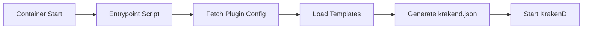

# KrakenD Template System Developer Guide

**Last Updated:** June 15, 2025  
**Template Version:** 2.0  
**Stack:** KrakenD Gateway  

## Overview

The KrakenD Gateway employs a sophisticated template-driven configuration system that dynamically generates routing rules, authentication policies, and plugin configurations based on runtime data from the BriggsBase API.

## 🏗️ Template Architecture

### Template System Components

```
/templates/
├── auth-validator.tmpl      # JWT validation configuration
├── plugins.tmpl             # Dynamic plugin route generation  
├── rate-limitor.tmpl        # Rate limiting rules
└── keycloak.tmpl           # Keycloak integration endpoints
```

### Template Processing Flow



## 📝 Template Syntax & Patterns

### Base Template Structure

```json
{
  "version": 3,
  "name": "KrakenD Gateway",
  "port": 8080,
  "host": ["0.0.0.0"],
  "timeout": "30s",
  "cache_ttl": "3600s",
  "endpoints": [
    {{template "plugins" .}},
    {{template "keycloak" .}},
    {{template "auth-validator" .}}
  ],
  "extra_config": {
    {{template "rate-limitor" .}}
  }
}
```

### Template Data Context

```go
// Template data structure
type TemplateData struct {
    Plugins      []PluginConfig     `json:"plugins"`
    Services     map[string]Service `json:"services"`
    Environment  string             `json:"environment"`
    JWTSecret    string             `json:"jwt_secret"`
    RateLimit    RateLimitConfig    `json:"rate_limit"`
    CORS         CORSConfig         `json:"cors"`
}

// Plugin configuration structure
type PluginConfig struct {
    ID           string            `json:"id"`
    Name         string            `json:"name"`
    DomainCode   string            `json:"domain_code"`
    ProjectCode  string            `json:"project_code"`
    Routes       []RouteConfig     `json:"routes"`
    Auth         AuthConfig        `json:"auth"`
    Backend      BackendConfig     `json:"backend"`
}
```

## 🔌 Plugin Template System

### Dynamic Plugin Route Generation (`plugins.tmpl`)

```json
{{range $plugin := .Plugins}}
{
  "endpoint": "/api/{{$plugin.DomainCode}}/{{$plugin.ProjectCode}}/{{$plugin.ID}}/{{.Path}}",
  "method": "{{.Method}}",
  "output_encoding": "json",
  "backend": [
    {
      "url_pattern": "{{$plugin.Backend.URLPattern}}",
      "host": ["{{$plugin.Backend.Host}}"],
      "method": "{{$plugin.Backend.Method}}",
      "encoding": "json",
      "extra_config": {
        {{if eq $plugin.Auth.Type "ProjectsDomains"}}
        "plugin/http-server": {
          "name": ["auth-plugin"],
          "auth-plugin": {
            "plugin_id": "{{$plugin.ID}}",
            "domain_code": "{{$plugin.DomainCode}}",
            "project_code": "{{$plugin.ProjectCode}}"
          }
        }
        {{end}}
      }
    }
  ],
  "extra_config": {
    {{template "cors-config" .}},
    {{if ne $plugin.Auth.Type "None"}}
    {{template "jwt-validation" $plugin.Auth}}
    {{end}}
  }
}{{if not (isLast $plugin $.Plugins)}},{{end}}
{{end}}
```

### Template Helper Functions

```go
// Custom template functions
var templateFuncs = template.FuncMap{
    "isLast": func(index int, slice []interface{}) bool {
        return index == len(slice)-1
    },
    "contains": func(slice []string, item string) bool {
        for _, s := range slice {
            if s == item {
                return true
            }
        }
        return false
    },
    "env": func(key string) string {
        return os.Getenv(key)
    },
    "default": func(defaultVal, val interface{}) interface{} {
        if val == nil || val == "" {
            return defaultVal
        }
        return val
    },
}
```

## 🔐 Authentication Template (`auth-validator.tmpl`)

### JWT Validation Configuration

```json
{
  "endpoint": "/auth/validate",
  "method": "POST",
  "output_encoding": "json",
  "backend": [
    {
      "url_pattern": "/auth/validate",
      "host": ["{{.Services.Auth.Host}}"],
      "method": "POST",
      "encoding": "json"
    }
  ],
  "extra_config": {
    "auth/validator": {
      "alg": "HS256",
      "jwk_url": "{{env "JWT_JWK_URL"}}",
      "audience": ["{{.Services.Auth.Audience}}"],
      "issuer": "{{.Services.Auth.Issuer}}",
      "roles_key": "roles",
      "roles": {{.Auth.RequiredRoles}},
      "propagate_claims": [
        ["sub", "x-user-id"],
        ["email", "x-user-email"],
        ["active_projects", "x-user-projects"],
        ["roles", "x-user-roles"]
      ]
    }
  }
}
```

### Conditional Authentication Logic

```json
{{if eq .Auth.Type "ProjectsDomains"}}
"auth/validator": {
  "alg": "HS256",
  "audience": ["gateway"],
  "issuer": "{{.Services.Keycloak.Issuer}}",
  "jwk_url": "{{.Services.Keycloak.JWKUrl}}",
  "propagate_claims": [
    ["sub", "x-user-id"],
    ["active_projects", "x-user-projects"]
  ],
  "operation_debug": {{env "JWT_DEBUG" | default "false"}}
}
{{else if eq .Auth.Type "AdminOnly"}}
"auth/validator": {
  "alg": "HS256",
  "audience": ["gateway"],
  "roles_key": "roles",
  "roles": ["admin"],
  "operation_debug": {{env "JWT_DEBUG" | default "false"}}
}
{{else if eq .Auth.Type "Basic"}}
"auth/basic": {
  "users": {{.Auth.BasicUsers}}
}
{{end}}
```

## 📊 Rate Limiting Template (`rate-limitor.tmpl`)

### Global Rate Limiting Configuration

```json
"qos/ratelimit/router": {
  "max_rate": {{.RateLimit.Global.MaxRate | default 1000}},
  "client_max_rate": {{.RateLimit.Global.ClientMaxRate | default 100}},
  "strategy": "{{.RateLimit.Global.Strategy | default "ip"}}",
  "key": "{{.RateLimit.Global.Key | default "X-USER-ID"}}",
  "capacity": {{.RateLimit.Global.Capacity | default 1000}},
  "every": "{{.RateLimit.Global.Every | default "1m"}}"
}
```

### Endpoint-Specific Rate Limiting

```json
{{range $endpoint := .RateLimit.Endpoints}}
{
  "endpoint": "{{$endpoint.Pattern}}",
  "extra_config": {
    "qos/ratelimit/proxy": {
      "max_rate": {{$endpoint.MaxRate}},
      "capacity": {{$endpoint.Capacity}},
      "every": "{{$endpoint.Every}}"
    }
  }
}{{if not (isLast $endpoint $.RateLimit.Endpoints)}},{{end}}
{{end}}
```

## 🔗 Keycloak Integration Template (`keycloak.tmpl`)

### Keycloak Endpoint Configuration

```json
{
  "endpoint": "/auth/keycloak/{path}",
  "method": "GET",
  "output_encoding": "json",
  "backend": [
    {
      "url_pattern": "/{path}",
      "host": ["{{.Services.Keycloak.Host}}"],
      "method": "GET",
      "encoding": "json"
    }
  ],
  "extra_config": {
    "modifier/jmespath": {
      "expr": "@"
    }
  }
},
{
  "endpoint": "/auth/token",
  "method": "POST",
  "output_encoding": "json",
  "backend": [
    {
      "url_pattern": "/realms/{{.Services.Keycloak.Realm}}/protocol/openid-connect/token",
      "host": ["{{.Services.Keycloak.Host}}"],
      "method": "POST",
      "encoding": "form"
    }
  ]
},
{
  "endpoint": "/auth/userinfo",
  "method": "GET",
  "output_encoding": "json",
  "backend": [
    {
      "url_pattern": "/realms/{{.Services.Keycloak.Realm}}/protocol/openid-connect/userinfo",
      "host": ["{{.Services.Keycloak.Host}}"],
      "method": "GET",
      "encoding": "json"
    }
  ],
  "extra_config": {
    "auth/validator": {
      "alg": "RS256",
      "jwk_url": "{{.Services.Keycloak.JWKUrl}}"
    }
  }
}
```

## 🛠️ Template Development Patterns

### Configuration Validation

```go
// Template validation before rendering
type TemplateValidator struct {
    requiredFields map[string][]string
    validators     map[string]ValidationFunc
}

func (v *TemplateValidator) ValidateData(data TemplateData) error {
    // Check required fields
    for template, fields := range v.requiredFields {
        for _, field := range fields {
            if err := v.checkField(data, field); err != nil {
                return fmt.Errorf("template %s: %w", template, err)
            }
        }
    }
    
    // Run custom validators
    for name, validator := range v.validators {
        if err := validator(data); err != nil {
            return fmt.Errorf("validator %s: %w", name, err)
        }
    }
    
    return nil
}
```

### Template Inheritance

```json
// Base template (base.tmpl)
{{define "base-endpoint"}}
{
  "endpoint": "{{.Endpoint}}",
  "method": "{{.Method}}",
  "output_encoding": "json",
  "backend": [{{template "backend" .}}],
  "extra_config": {
    {{template "extra-config" .}}
  }
}
{{end}}

// Plugin template extends base
{{template "base-endpoint" .}}
{{define "backend"}}
{
  "url_pattern": "{{.Backend.URLPattern}}",
  "host": ["{{.Backend.Host}}"],
  "method": "{{.Backend.Method}}"
}
{{end}}
```

### Dynamic Template Loading

```go
// Template loader with hot reload
type TemplateLoader struct {
    templateDir string
    templates   map[string]*template.Template
    watcher     *fsnotify.Watcher
}

func (tl *TemplateLoader) LoadTemplates() error {
    files, err := filepath.Glob(filepath.Join(tl.templateDir, "*.tmpl"))
    if err != nil {
        return err
    }
    
    for _, file := range files {
        name := filepath.Base(file)
        tmpl, err := template.New(name).Funcs(templateFuncs).ParseFiles(file)
        if err != nil {
            return fmt.Errorf("failed to parse template %s: %w", name, err)
        }
        tl.templates[name] = tmpl
    }
    
    return nil
}
```

## 🔄 Template Processing Pipeline

### Build-time Template Processing

```bash
#!/bin/bash
# Template processing during Docker build

# Validate template syntax
for template in /templates/*.tmpl; do
    echo "Validating template: $template"
    go run template-validator.go "$template" || exit 1
done

# Generate template documentation
go run template-docs-generator.go /templates /docs/templates

# Create template test cases
go run template-test-generator.go /templates /tests/templates
```

### Runtime Template Rendering

```go
// Runtime template rendering in entrypoint script
func renderTemplates(data TemplateData) error {
    mainTemplate := template.New("main")
    
    // Load all templates
    templates, err := template.ParseGlob("/templates/*.tmpl")
    if err != nil {
        return fmt.Errorf("failed to load templates: %w", err)
    }
    
    // Execute main template
    var output bytes.Buffer
    if err := templates.ExecuteTemplate(&output, "main.tmpl", data); err != nil {
        return fmt.Errorf("failed to render template: %w", err)
    }
    
    // Write krakend.json
    return ioutil.WriteFile("/etc/krakend/krakend.json", output.Bytes(), 0644)
}
```

## 🧪 Template Testing Strategies

### Unit Testing Templates

```go
func TestPluginTemplate(t *testing.T) {
    tmpl := template.Must(template.ParseFiles("templates/plugins.tmpl"))
    
    testData := TemplateData{
        Plugins: []PluginConfig{
            {
                ID:          "test-plugin",
                DomainCode:  "TEST",
                ProjectCode: "PROJ1",
                Routes: []RouteConfig{
                    {Path: "health", Method: "GET"},
                },
            },
        },
    }
    
    var output bytes.Buffer
    err := tmpl.Execute(&output, testData)
    
    assert.NoError(t, err)
    
    // Validate JSON output
    var config map[string]interface{}
    err = json.Unmarshal(output.Bytes(), &config)
    assert.NoError(t, err)
    
    // Check specific fields
    endpoints := config["endpoints"].([]interface{})
    assert.Len(t, endpoints, 1)
}
```

### Integration Testing

```go
func TestFullTemplateRendering(t *testing.T) {
    // Load test configuration
    testConfig := loadTestConfig("testdata/full-config.json")
    
    // Render all templates
    rendered, err := renderAllTemplates(testConfig)
    assert.NoError(t, err)
    
    // Validate KrakenD configuration
    err = validateKrakenDConfig(rendered)
    assert.NoError(t, err)
    
    // Test specific endpoints
    config := parseKrakenDConfig(rendered)
    
    // Check plugin endpoints
    pluginEndpoints := filterEndpoints(config, "/api/")
    assert.NotEmpty(t, pluginEndpoints)
    
    // Check auth endpoints
    authEndpoints := filterEndpoints(config, "/auth/")
    assert.NotEmpty(t, authEndpoints)
}
```

## 📊 Template Performance Optimization

### Template Caching

```go
// Template cache with TTL
type TemplateCache struct {
    cache     map[string]*CachedTemplate
    mutex     sync.RWMutex
    defaultTTL time.Duration
}

type CachedTemplate struct {
    template  *template.Template
    createdAt time.Time
    ttl       time.Duration
}

func (tc *TemplateCache) Get(name string) (*template.Template, bool) {
    tc.mutex.RLock()
    defer tc.mutex.RUnlock()
    
    cached, exists := tc.cache[name]
    if !exists {
        return nil, false
    }
    
    if time.Since(cached.createdAt) > cached.ttl {
        delete(tc.cache, name)
        return nil, false
    }
    
    return cached.template, true
}
```

### Parallel Template Processing

```go
// Process templates in parallel
func renderTemplatesParallel(data TemplateData) (map[string]string, error) {
    templates := []string{"plugins", "auth-validator", "rate-limitor", "keycloak"}
    results := make(chan TemplateResult, len(templates))
    
    for _, tmplName := range templates {
        go func(name string) {
            result := TemplateResult{Name: name}
            result.Output, result.Error = renderTemplate(name, data)
            results <- result
        }(tmplName)
    }
    
    // Collect results
    rendered := make(map[string]string)
    for i := 0; i < len(templates); i++ {
        result := <-results
        if result.Error != nil {
            return nil, result.Error
        }
        rendered[result.Name] = result.Output
    }
    
    return rendered, nil
}
```

## 🚨 Template Error Handling

### Validation Errors

```go
// Template validation errors
type TemplateError struct {
    Template string `json:"template"`
    Line     int    `json:"line"`
    Column   int    `json:"column"`
    Message  string `json:"message"`
    Context  string `json:"context"`
}

func (e TemplateError) Error() string {
    return fmt.Sprintf("template %s:%d:%d: %s", e.Template, e.Line, e.Column, e.Message)
}

// Error collection during validation
func validateTemplate(tmpl *template.Template, data interface{}) []TemplateError {
    var errors []TemplateError
    
    // Execute template to buffer
    var buf bytes.Buffer
    if err := tmpl.Execute(&buf, data); err != nil {
        errors = append(errors, parseTemplateError(err))
    }
    
    // Validate JSON output
    if err := json.Unmarshal(buf.Bytes(), &map[string]interface{}{}); err != nil {
        errors = append(errors, TemplateError{
            Message: "Invalid JSON output",
            Context: err.Error(),
        })
    }
    
    return errors
}
```

## 📚 Template Configuration Reference

### Environment Variables in Templates

| Variable | Description | Template Usage |
|----------|-------------|----------------|
| `JWT_SECRET` | JWT signing secret | `{{env "JWT_SECRET"}}` |
| `JWT_DEBUG` | Enable JWT debugging | `{{env "JWT_DEBUG" \| default "false"}}` |
| `RATE_LIMIT_GLOBAL` | Global rate limit | `{{env "RATE_LIMIT_GLOBAL" \| default "1000"}}` |
| `CORS_ORIGINS` | Allowed CORS origins | `{{env "CORS_ORIGINS" \| default "*"}}` |

### Template Data Schema

```json
{
  "$schema": "http://json-schema.org/draft-07/schema#",
  "type": "object",
  "properties": {
    "plugins": {
      "type": "array",
      "items": {
        "type": "object",
        "properties": {
          "id": {"type": "string"},
          "domain_code": {"type": "string"},
          "project_code": {"type": "string"},
          "routes": {
            "type": "array",
            "items": {
              "type": "object",
              "properties": {
                "path": {"type": "string"},
                "method": {"type": "string"},
                "authorization": {"type": "string"}
              }
            }
          }
        }
      }
    },
    "services": {
      "type": "object",
      "properties": {
        "keycloak": {
          "type": "object",
          "properties": {
            "host": {"type": "string"},
            "realm": {"type": "string"},
            "jwk_url": {"type": "string"}
          }
        }
      }
    }
  }
}
```

---

**Related Documentation:**
- `krakend-auth-plugin-development.md` - Custom auth plugin development
- `krakend-dynamic-plugins.md` - Plugin discovery system
- `krakend-service-integration.md` - Service integration patterns
- `authentication-architecture-principles.md` - Security architecture
